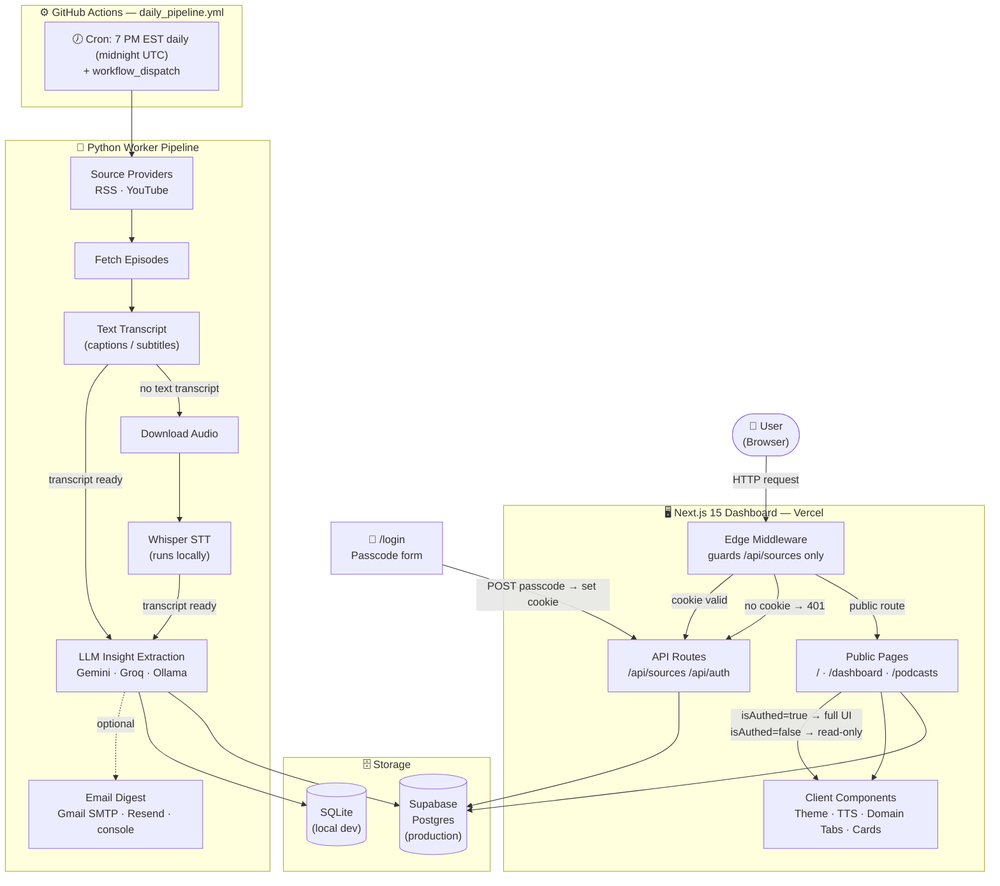

# System Architecture

## Layer Summary

| Layer | Technology | Role |
|---|---|---|
| **Scheduler** | GitHub Actions (cron) | Triggers pipeline daily at 7 PM EST (midnight UTC) |
| **Source** | Python — RSS / yt-dlp | Fetches episode metadata and audio |
| **Transcription** | OpenAI Whisper (local) | Converts audio to text when no caption is available |
| **LLM** | Gemini / Groq / Ollama | Extracts summary, key points, quotes, and action items |
| **Storage** | Supabase (prod) / SQLite (dev) | Persists episodes, transcripts, and insights |
| **Email** | Gmail SMTP / Resend | Delivers optional daily digest |
| **Dashboard** | Next.js 15 on Vercel | Displays insights; manages podcast sources |
| **Auth** | Edge Middleware + HTTP-only cookie | Guards `/api/sources`; `/podcasts` is public (read-only for guests) |

## Provider Switching

All providers swap via `.env` — no code changes needed:

| Setting | Default | Alternatives |
|---|---|---|
| `TRANSCRIPTION_PROVIDER` | `local_whisper` | `openai_whisper_api` |
| `LLM_PROVIDER` | `gemini` | `groq` · `ollama` · `openai` · `anthropic` |
| `STORAGE_PROVIDER` | `sqlite` | `supabase` |
| `EMAIL_PROVIDER` | `console` | `gmail_smtp` · `resend` |
