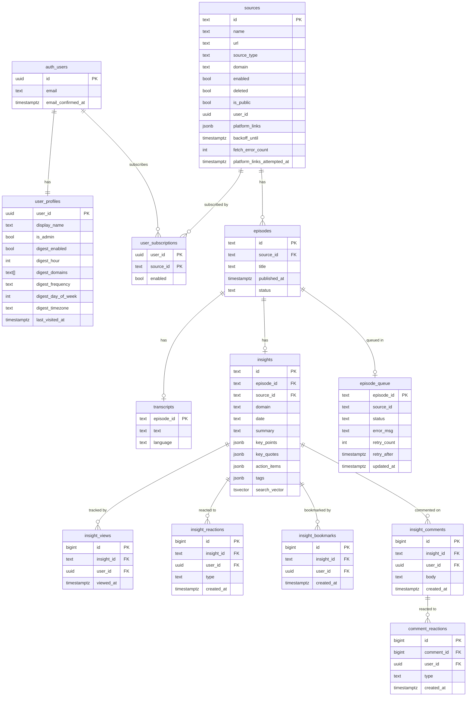

# System Architecture

```mermaid
graph TB
    subgraph CI["⚙️ GitHub Actions"]
        CRON["🕛 daily_pipeline.yml\nCron: 6 AM UTC (ingestion)\n+ workflow_dispatch\n(since_days, force_email,\nepisode_audio_url, source_id, target_email)"]
        HCRON["🕐 hourly_digest.yml\nCron: every hour\nper-user digest fan-out\n+ workflow_dispatch\n(date, force, target_email)"]
        WCRON["📅 weekly_recommendations.yml\nCron: Sundays 10 AM UTC\nweekly recommendations email"]
    end

    subgraph PIPELINE["🐍 Python Worker Pipeline"]
        SRC["Source Providers\nRSS · YouTube"]
        FETCH["Fetch Episodes\n(parallel, 8 workers)"]
        TXT["Text Transcript\n(captions / subtitles)"]
        AUDIO["Download Audio"]
        WHISPER["Whisper STT\n(tiny model, local)\ndomain-aware initial_prompt"]
        LLM["LLM Insight Extraction\nGemini → Groq fallback"]
        FANOUT["Per-User Digest Fan-out\nuser_profiles × user_subscriptions"]
        EMAIL["Gmail SMTP\nPersonalized HTML email"]
        RECJOB["Weekly Recommendations Job\nLLM rank_insights + get_trending_sources"]
    end

    subgraph STORE["🗄️ Supabase PostgreSQL"]
        SOURCES[("sources\nis_public, user_id")]
        EPISODES[("episodes\nstatus: done/pending")]
        TRANSCRIPTS[("transcripts")]
        INSIGHTS[("insights\ndate, domain, source_id")]
        EPQUEUE[("episode_queue\nepisode_id, status\ndone·failed·pending")]
        VIEWS[("insight_views\ninsight_id, user_id")]
        REACTIONS[("insight_reactions\ninsight_id, user_id, type")]
        BOOKMARKS[("insight_bookmarks\ninsight_id, user_id")]
        COMMENTS[("insight_comments\ninsight_id, user_id, body")]
        CREACTIONS[("comment_reactions\ncomment_id, user_id, type")]
        PROFILES[("user_profiles\nis_admin, digest_enabled\ndigest_hour, digest_domains[]\ndigest_frequency, digest_day_of_week\nlast_visited_at")]
        SUBS[("user_subscriptions\nuser_id → source_id")]
        AUTHUSERS[("auth.users\nSupabase Auth")]
    end

    subgraph AUTH["🔐 Supabase Auth"]
        JWT["JWT + SSR Cookies\n(@supabase/ssr)"]
        RLS["Row Level Security\nsources · user_profiles\nuser_subscriptions"]
    end

    subgraph REALTIME["⚡ Supabase Realtime"]
        RT["postgres_changes WebSocket\nINSERT on insights table\nINSERT/UPDATE on episode_queue"]
    end

    subgraph DASH["🌐 Next.js 15 Dashboard — Vercel"]
        MW["middleware.ts\nSession refresh · API guard"]
        LAYOUT["layout.tsx (async)\ngetUser() + getDisplayName()"]
        DPAGE["dashboard/page.tsx\nPersonalized or public preview\n+ CSV export button"]
        PPAGE["podcasts/page.tsx\nCatalog + subscribe toggles"]
        PROF["profile/page.tsx\nDisplay name · digest prefs"]
        APAGE["analytics/page.tsx\nKPI cards · chart · top insights"]
        SPAGE["saved/page.tsx\nBookmarked insights list"]
        ONBOARD["onboarding/page.tsx\nDomain picker + subscribe wizard"]
        REG["register/page.tsx"]
        LOGIN["login/page.tsx"]
        CACHE["unstable_cache\n1h TTL — public views only"]
    end

    subgraph APIROUTES["📡 API Routes"]
        ARAUTH["/api/auth/\nlogin · logout · register"]
        ARSRC["/api/sources\nPOST: authed users\nPATCH/DELETE: admin only"]
        ARSUBS["/api/subscriptions\nauthed users"]
        ARPROF["/api/profile\nauthed users"]
        ARDIG["/api/digest/send\nauthed users — on-demand email"]
        ARDIGEPI["/api/digest/episodes\nRSS-aware episode list"]
        ARDIGPROC["/api/digest/process\ntriggers workflow_dispatch"]
        ARDIGSTAT["/api/digest/status\npoll for insights"]
        ARSEARCH["/api/podcasts/search\nproxies iTunes Search API"]
        ARREC["/api/recommendations/podcasts\nGET ?domains= → catalog + iTunes suggestions"]
        ARENG["/api/insights/[id]/engagement\nGET ?view=1 · /unread DELETE\n/react · /bookmark · /comments\n/api/comments/[id]\n/react · DELETE"]
        AREXP["/api/insights/export\nGET ?format=csv|pdf&date=\nauthed — download insights"]
        ARFTS["/api/insights/search\nGET ?q= ?domain= ?from= ?to=\nwebsearch FTS + filters"]
        ARREV["/api/revalidate\nPOST — bust public insight cache"]
        ARDIGPREV["/api/digest/preview\nGET — returns digest HTML\n(no email sent)"]
    end

    HCRON --> FANOUT
    WCRON --> RECJOB
    RECJOB --> INSIGHTS
    RECJOB --> SUBS
    RECJOB --> EMAIL
    CRON --> SRC
    SRC --> FETCH
    FETCH --> TXT
    TXT -->|no captions| AUDIO
    AUDIO --> WHISPER
    WHISPER --> LLM
    TXT --> LLM
    LLM --> INSIGHTS
    LLM --> EPISODES
    LLM --> TRANSCRIPTS
    FETCH --> SOURCES

    INSIGHTS --> FANOUT
    PROFILES --> FANOUT
    SUBS --> FANOUT
    FANOUT --> EMAIL

    AUTHUSERS --> PROFILES
    AUTHUSERS --> JWT
    JWT --> RLS
    RLS --> SOURCES
    RLS --> PROFILES
    RLS --> SUBS

    MW --> LAYOUT
    LAYOUT --> DPAGE
    LAYOUT --> PPAGE
    LAYOUT --> PROF
    LAYOUT --> APAGE
    LAYOUT --> SPAGE
    LAYOUT --> ONBOARD
    LAYOUT --> REG
    LAYOUT --> LOGIN

    DPAGE --> CACHE
    CACHE --> INSIGHTS
    DPAGE --> SUBS

    PPAGE --> SOURCES
    PPAGE --> SUBS

    ARAUTH --> AUTHUSERS
    ARSRC --> SOURCES
    ARSUBS --> SUBS
    ARPROF --> PROFILES
    ARDIG --> INSIGHTS
    ARDIG --> EMAIL
    ARDIGEPI --> INSIGHTS
    ARDIGEPI -.->|RSS feed| SOURCES
    ARDIGPROC -.->|workflow_dispatch| CI
    ARDIGSTAT --> INSIGHTS
    ARREC --> SOURCES
    ARREC -.->|iTunes API| ARSEARCH
    ONBOARD --> ARREC
    ONBOARD --> ARSUBS
    ARSEARCH -.->|iTunes API| SOURCES
    ARENG --> VIEWS
    ARENG --> REACTIONS
    ARENG --> BOOKMARKS
    ARENG --> COMMENTS
    ARENG --> CREACTIONS
    SPAGE --> BOOKMARKS
    ARFTS --> INSIGHTS
    AREXP --> INSIGHTS
    APAGE --> INSIGHTS
    APAGE --> VIEWS
    APAGE --> SUBS
    ARDIGPREV --> INSIGHTS
    LLM -.->|POST after insights saved| ARREV
    ARREV -.->|revalidateTag insights| CACHE

    LLM --> EPQUEUE
    INSIGHTS -.->|Realtime broadcast| RT
    EPQUEUE -.->|Realtime broadcast| RT
    RT -.->|WebSocket push| DASH
```

---

## Data Model

---

## Provider Registry

Providers are resolved from environment variables at runtime — no code changes needed to switch backends:

| Env var | Options |
|---|---|
| `STORAGE_PROVIDER` | `sqlite` (dev) · `supabase` (prod) — controls content storage only; Supabase is always required for auth and engagement |
| `LLM_PROVIDER` | `gemini` · `groq` · `ollama` |
| `TRANSCRIPTION_PROVIDER` | `local_whisper` |
| `EMAIL_PROVIDER` | `console` (dev) · `gmail_smtp` (prod) |
