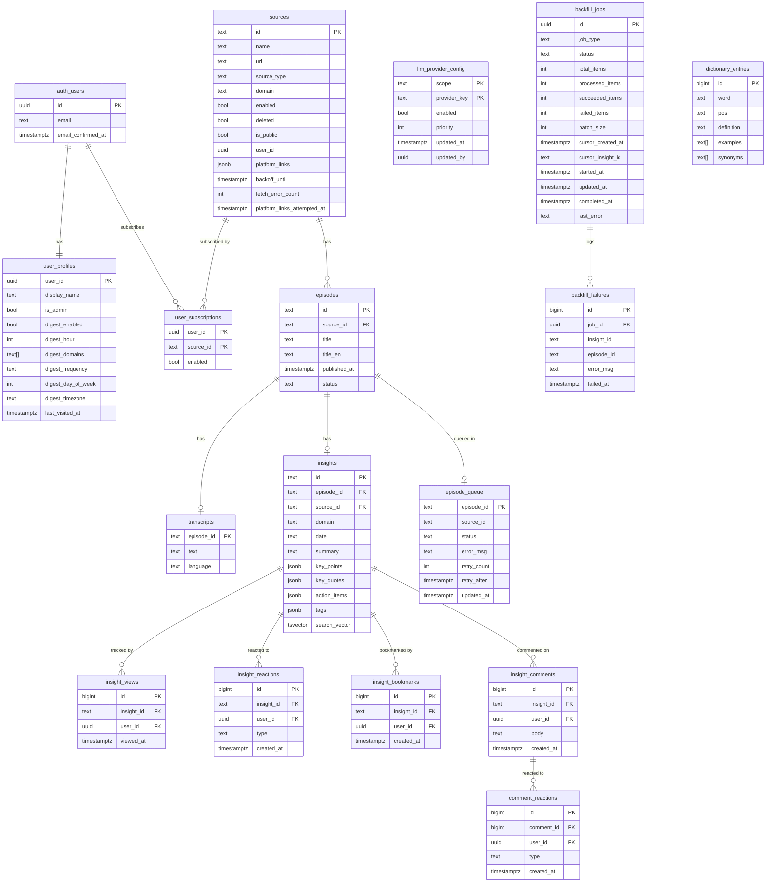

# System Architecture

```mermaid
graph TB
    subgraph CI["⚙️ GitHub Actions"]
        CRON["🕛 daily_pipeline.yml\nCron: every 4 hours (ingestion)\n+ workflow_dispatch\n(since_days, force_email,\nepisode_audio_url, source_id, target_email)"]
        HCRON["🕐 hourly_digest.yml\nCron: every hour\nper-user digest fan-out\n+ workflow_dispatch\n(date, force, target_email)"]
        WCRON["📅 weekly_recommendations.yml\nCron: Sundays 10 AM UTC\nweekly recommendations email"]
        BCRON["♻️ backfill_insights.yml\nCron: daily 3:30 AM UTC\n+ workflow_dispatch (batch_size)\nresumable, spans many runs/days"]
        RCRON["🔁 retry_failed_episodes.yml\nCron: 4×/day (2,8,14,20 UTC)\n+ workflow_dispatch (limit)\nfresh waterfall instance per run"]
    end

    subgraph PIPELINE["🐍 Python Worker Pipeline"]
        SRC["Source Providers\nRSS · YouTube"]
        FETCH["Fetch Episodes\n(parallel, 8 workers)"]
        TXT["Text Transcript\n(captions / subtitles)"]
        AUDIO["Download Audio"]
        WHISPER["Whisper STT\n(tiny model, local)\ndomain-aware initial_prompt"]
        LLM["LLM Insight Extraction\nWaterfall: Gemini → Groq 8B/70B →\nMistral → Cohere → Cerebras → 4× OpenRouter\nchunked map-reduce for long transcripts\nserialized per-episode (_LLM_LOCK);\nsticky dead-provider fallback;\ndefers (no retry penalty) once all dead"]
        FANOUT["Per-User Digest Fan-out\nuser_profiles × user_subscriptions"]
        EMAIL["Gmail SMTP\nPersonalized HTML email"]
        RECJOB["Weekly Recommendations Job\nLLM-ranked (scope=recommendations,\nheuristic fallback) + get_trending_sources"]
        BACKFILLJOB["Insight Backfill Job\nRe-extracts via waterfall (scope=pipeline)\nfrom saved transcript; resumable cursor;\none bounded batch per invocation"]
        RETRYJOB["Retry Failed Episodes Job\nReuses _process_episode (transcript-cache\nskip + exhaustion short-circuit);\nbounded batch, stops early if exhausted again"]
    end

    subgraph STORE["🗄️ Supabase PostgreSQL"]
        SOURCES[("sources\nis_public, user_id")]
        EPISODES[("episodes\nstatus: done/pending")]
        TRANSCRIPTS[("transcripts")]
        INSIGHTS[("insights\ndate, domain, source_id")]
        EPQUEUE[("episode_queue\nepisode_id, status\ndone·failed·pending")]
        VIEWS[("insight_views\ninsight_id, user_id")]
        REACTIONS[("insight_reactions\ninsight_id, user_id, type")]
        BOOKMARKS[("insight_bookmarks\ninsight_id, user_id")]
        COMMENTS[("insight_comments\ninsight_id, user_id, body")]
        CREACTIONS[("comment_reactions\ncomment_id, user_id, type")]
        PROFILES[("user_profiles\nis_admin, digest_enabled\ndigest_hour, digest_domains[]\ndigest_frequency, digest_day_of_week\nlast_visited_at")]
        SUBS[("user_subscriptions\nuser_id → source_id")]
        AUTHUSERS[("auth.users\nSupabase Auth")]
        LLMCONFIG[("llm_provider_config\nscope, provider_key,\nenabled, priority")]
        BACKFILLJOBS[("backfill_jobs\nstatus, total/processed/\nsucceeded/failed_items,\ncursor_created_at, cursor_insight_id")]
        BACKFILLFAILS[("backfill_failures\njob_id, insight_id,\nepisode_id, error_msg")]
        DICT[("dictionary_entries\nword, pos, definition,\nexamples[], synonyms[]\nseeded from WordNet")]
    end

    subgraph AUTH["🔐 Supabase Auth"]
        JWT["JWT + SSR Cookies\n(@supabase/ssr)"]
        RLS["Row Level Security\nsources · user_profiles\nuser_subscriptions"]
    end

    subgraph REALTIME["⚡ Supabase Realtime"]
        RT["postgres_changes WebSocket\nINSERT on insights table\nINSERT/UPDATE on episode_queue\nINSERT/DELETE on user_profiles (admin only, migration 016)"]
    end

    subgraph DASH["🌐 Next.js 15 Dashboard — Vercel"]
        MW["middleware.ts\nSession refresh · API guard"]
        LAYOUT["layout.tsx (async)\ngetUser() + getDisplayName()"]
        DPAGE["dashboard/page.tsx\nPersonalized or public preview\n+ PDF/Excel/Word export button"]
        PPAGE["podcasts/page.tsx\nCatalog + subscribe toggles"]
        PROF["profile/page.tsx\nDisplay name · digest prefs"]
        APAGE["analytics/page.tsx\nKPI cards · chart · top insights"]
        SPAGE["saved/page.tsx\nBookmarked insights list"]
        ASKPAGE["ask/page.tsx + AskChat.tsx\nLLM Q&A chat UI — two modes:\nMy Podcasts (FTS, personalized suggestions)\nAsk About an Episode (podcast→episode picker,\nreads ?episode=<id> deep link)"]
        ONBOARD["onboarding/page.tsx\nDomain picker + subscribe wizard"]
        ADMINUSERS["admin/users/page.tsx\nAdmin-only — list/search users,\ngrant/revoke admin, reset onboarding,\ncascade-delete user"]
        ADMINLLM["admin/llm-providers/page.tsx\nAdmin-only — toggle/reorder waterfall\nper feature (Pipeline, Ask AI, Recommendations)"]
        ADMINTASK["admin/task-status/page.tsx\nAdmin-only — GitHub Actions runners\n(run now/cancel, polled) +\nFailed Episodes list (retry now)"]
        RECPAGE["recommendations/page.tsx\nOn-demand best-of-week insights\n+ trending podcasts, Refresh button"]
        REG["register/page.tsx"]
        LOGIN["login/page.tsx"]
        CACHE["unstable_cache\n1h TTL — public views only"]
    end

    subgraph APIROUTES["📡 API Routes"]
        ARAUTH["/api/auth/\nlogin · logout · register"]
        ARSRC["/api/sources\nPOST: authed users\nPATCH/DELETE: admin only"]
        ARSUBS["/api/subscriptions\nauthed users"]
        ARPROF["/api/profile\nauthed users"]
        ARDIG["/api/digest/send\nauthed users — on-demand email"]
        ARDIGEPI["/api/digest/episodes\nRSS-aware episode list"]
        ARDIGPROC["/api/digest/process\ntriggers workflow_dispatch"]
        ARDIGSTAT["/api/digest/status\npoll for insights"]
        ARSEARCH["/api/podcasts/search\nproxies iTunes Search API"]
        ARREC["/api/recommendations/podcasts\nGET ?domains= → catalog + iTunes suggestions"]
        ARENG["/api/insights/[id]/engagement\nGET ?view=1 · /unread DELETE\n/react · /bookmark · /comments\n/api/comments/[id]\n/react · DELETE"]
        AREXP["/api/insights/export\nGET ?format=excel|word&date=\nauthed — download insights\n(PDF generated client-side via jsPDF)"]
        ARFTS["/api/insights/search\nGET ?q= ?domain= ?from= ?to=\nwebsearch FTS + filters"]
        ARASK["/api/ask\nPOST — LLM Q&A\nnamed-podcast lookup + FTS context\n6-model waterfall: Gemini→Groq 8B→Groq 70B→Mistral→Together→Cohere\norder/enabled from llm_provider_config"]
        ARASKSUGGEST["/api/ask/suggestions\nGET — personalized suggested questions\nfrom subscriptions + last-7-days insights\n(templated, no LLM call)"]
        ARASKEPISODE["/api/ask/episode\nGET ?id= episode meta (picker/deep link)\nPOST { episodeId, question } — answers from\nthat episode's saved transcript directly,\nno insight required; scope=ask_ai waterfall"]
        ARADMINUSERS["/api/admin/users\nGET list (admin only)\n/[id] PATCH is_admin|reset_onboarding\n/[id] DELETE — auth.admin.deleteUser cascade\n/[id]/subscriptions GET catalog+subs · POST/DELETE sourceId"]
        ARADMINLLM["/api/admin/llm-providers\nGET providers by scope (admin only)\nPATCH scope, provider_key, enabled?, priority?"]
        ARFAILEDEPS["/api/admin/failed-episodes\nGET episode_queue status='failed' rows\nPOST — workflow_dispatch retry now"]
        ARADMINWORKFLOWS["/api/admin/workflows\nGET every GH Actions workflow + latest run\nPOST { action: dispatch|cancel }"]
        ARRECOMMEND["/api/recommendations\nGET — on-demand LLM ranking (scope=recommendations)\n+ trending unsubscribed podcasts, authed"]
        ARREV["/api/revalidate\nPOST — bust public insight cache"]
        ARDIGPREV["/api/digest/preview\nGET — returns digest HTML\n(no email sent)"]
        ARDICT["/api/dictionary\nGET ?word= — direct retrieval,\nno LLM call; public, no auth"]
    end

    HCRON --> FANOUT
    WCRON --> RECJOB
    RECJOB --> INSIGHTS
    RECJOB --> SUBS
    RECJOB --> EMAIL
    RECJOB -.->|reads at run start, scope=recommendations| LLMCONFIG
    BCRON --> BACKFILLJOB
    BACKFILLJOB --> INSIGHTS
    BACKFILLJOB --> TRANSCRIPTS
    BACKFILLJOB -.->|reads at run start, scope=pipeline| LLMCONFIG
    BACKFILLJOB --> BACKFILLJOBS
    BACKFILLJOB --> BACKFILLFAILS
    RCRON --> RETRYJOB
    RETRYJOB --> INSIGHTS
    RETRYJOB --> TRANSCRIPTS
    RETRYJOB -.->|fresh instance each run, scope=pipeline| LLMCONFIG
    RETRYJOB --> EPQUEUE
    CRON --> SRC
    SRC --> FETCH
    FETCH --> TXT
    TXT -->|no captions| AUDIO
    AUDIO --> WHISPER
    WHISPER --> LLM
    TXT --> LLM
    LLM --> INSIGHTS
    LLM --> EPISODES
    LLM --> TRANSCRIPTS
    FETCH --> SOURCES

    INSIGHTS --> FANOUT
    PROFILES --> FANOUT
    SUBS --> FANOUT
    FANOUT --> EMAIL

    AUTHUSERS --> PROFILES
    AUTHUSERS --> JWT
    JWT --> RLS
    RLS --> SOURCES
    RLS --> PROFILES
    RLS --> SUBS

    MW --> LAYOUT
    LAYOUT --> DPAGE
    LAYOUT --> PPAGE
    LAYOUT --> PROF
    LAYOUT --> APAGE
    LAYOUT --> SPAGE
    LAYOUT --> ONBOARD
    LAYOUT --> ADMINUSERS
    LAYOUT --> ADMINLLM
    LAYOUT --> ADMINTASK
    LAYOUT --> RECPAGE
    LAYOUT --> REG
    LAYOUT --> LOGIN

    DPAGE --> CACHE
    CACHE --> INSIGHTS
    DPAGE --> SUBS

    PPAGE --> SOURCES
    PPAGE --> SUBS

    ARAUTH --> AUTHUSERS
    ARSRC --> SOURCES
    ARSUBS --> SUBS
    ARPROF --> PROFILES
    ARDIG --> INSIGHTS
    ARDIG --> EMAIL
    ARDIGEPI --> INSIGHTS
    ARDIGEPI -.->|RSS feed| SOURCES
    ARDIGPROC -.->|workflow_dispatch| CI
    ARDIGSTAT --> INSIGHTS
    ARREC --> SOURCES
    ARREC -.->|iTunes API| ARSEARCH
    ONBOARD --> ARREC
    ONBOARD --> ARSUBS
    ARSEARCH -.->|iTunes API| SOURCES
    ARENG --> VIEWS
    ARENG --> REACTIONS
    ARENG --> BOOKMARKS
    ARENG --> COMMENTS
    ARENG --> CREACTIONS
    SPAGE --> BOOKMARKS
    ARFTS --> INSIGHTS
    ARASK --> INSIGHTS
    ARASK --> SUBS
    AREXP --> INSIGHTS
    APAGE --> INSIGHTS
    APAGE --> VIEWS
    APAGE --> SUBS
    ARDIGPREV --> INSIGHTS
    LLM -.->|POST after insights saved| ARREV
    ARREV -.->|revalidateTag insights| CACHE

    ADMINUSERS --> ARADMINUSERS
    ARADMINUSERS --> AUTHUSERS
    ARADMINUSERS --> PROFILES
    ARADMINUSERS --> SUBS
    ARADMINUSERS --> SOURCES
    PROFILES -.->|Realtime broadcast, migration 016| RT
    RT -.->|WebSocket push| ADMINUSERS

    ADMINLLM --> ARADMINLLM
    ARADMINLLM --> LLMCONFIG
    LLM -.->|reads at run start, scope=pipeline| LLMCONFIG
    ARASK -.->|reads per question, scope=ask_ai| LLMCONFIG

    ASKPAGE --> ARASKSUGGEST
    ARASKSUGGEST --> SUBS
    ARASKSUGGEST --> INSIGHTS
    ASKPAGE --> ARASKEPISODE
    ARASKEPISODE --> EPISODES
    ARASKEPISODE --> TRANSCRIPTS
    ARASKEPISODE --> SUBS
    ARASKEPISODE -.->|reads per question, scope=ask_ai| LLMCONFIG
    DPAGE -.->|"Ask AI" button on Insight Card, ?episode=id| ASKPAGE
    PROF -.->|"Ask AI about this episode" on Episode Digest picker, ?episode=id| ASKPAGE

    RECPAGE --> ARRECOMMEND
    ARRECOMMEND --> INSIGHTS
    ARRECOMMEND --> SOURCES
    ARRECOMMEND --> SUBS
    ARRECOMMEND -.->|reads per request, scope=recommendations, 5 JS-callable providers only| LLMCONFIG

    ADMINTASK --> ARFAILEDEPS
    ARFAILEDEPS --> EPQUEUE
    ARFAILEDEPS -.->|workflow_dispatch retry_failed_episodes.yml| CI
    ADMINTASK --> ARADMINWORKFLOWS
    ARADMINWORKFLOWS -.->|list/dispatch/cancel via GitHub API| CI

    DPAGE -.->|double-click / toggle word on Insight Card| ARDICT
    ARDICT --> DICT

    LLM --> EPQUEUE
    INSIGHTS -.->|Realtime broadcast| RT
    EPQUEUE -.->|Realtime broadcast| RT
    RT -.->|WebSocket push| DASH
```

---

## Data Model

---

## Provider Registry

Providers are resolved from environment variables at runtime — no code changes needed to switch backends:

| Env var | Options |
|---|---|
| `STORAGE_PROVIDER` | `sqlite` (dev) · `supabase` (prod) — controls content storage only; Supabase is always required for auth and engagement |
| `LLM_PROVIDER` | `gemini` · `groq` · `mistral` · `cohere` · `cerebras` · `ollama` · `waterfall` (chains every configured provider — see below) |
| `TRANSCRIPTION_PROVIDER` | `local_whisper` |
| `EMAIL_PROVIDER` | `console` (dev) · `gmail_smtp` (prod) |

### LLM Waterfall (`LLM_PROVIDER=waterfall`)

`worker/providers/llm/provider_registry.py` declares every provider *adapter* that exists in code (`PROVIDER_SLOTS`) — currently Gemini, Groq 8B, Groq 70B, Mistral, Cohere, Cerebras, and 4 OpenRouter free models (10 total). `build_enabled_slots(config)` resolves that list against:

1. Whether the slot's env var (e.g. `OPENROUTER_API_KEY`) is actually set
2. Admin-configured `enabled`/`priority` overrides in `llm_provider_config` (scope `pipeline`), editable at `/admin/llm-providers` without a deploy

`WaterfallLLM` (`waterfall.py`) then tries each enabled slot in priority order per chunk. On failure or quota exhaustion it falls through to the next — and marks that provider "sticky dead" for the rest of the run, so later chunks skip straight past it instead of re-trying (and re-failing) it every time; `all_dead` flips true once every slot has failed. Long transcripts are handled by `chunking.py`'s shared chunked map-reduce: split → per-chunk summarize → synthesize one structured insight.

The daily ingestion pipeline (`worker/jobs/pipeline.py`) serializes LLM extraction across its 4 concurrent episode workers (`_LLM_LOCK`) — transcript fetch/audio download stay parallel, but only one episode is ever inside its chunk map-reduce at a time, so a burst of concurrent requests can't trip a shared provider's per-minute rate limit and cascade "dead" onto unrelated episodes. Once `all_providers_dead` is true, `_process_episode()` returns a `"deferred"` status for every remaining episode without attempting any work and without counting against that episode's retry limit — it's picked up fresh whenever quota is next available, either by the next scheduled `daily_pipeline.yml` run or by `retry_failed_episodes.yml` (a dedicated recovery job on its own 4×/day schedule, building a fresh waterfall instance each time so a run that previously found every provider dead gets a real second chance rather than reusing exhausted state).

The dashboard's Ask AI chat (`/api/ask`) has its own independent 6-slot waterfall (adds Together AI, omits the 4 OpenRouter models), configured the same way but under scope `ask_ai` — see [request-workflow.md](request-workflow.md) for its sequence diagram. `/api/ask/episode` (answering a question from one episode's saved transcript directly, rather than FTS-retrieved insight content) reuses this exact same `ask_ai`-scoped waterfall via `lib/llm-waterfall.ts`.

A third scope, `recommendations`, ranks the best insights from the past week (replacing a pure "sort by richness" heuristic with an actual LLM call). It has two call sites reading the *same* config rows but with different provider reach: the worker's weekly job (`WaterfallLLMProvider(scope="recommendations")`, all 10 pipeline-style adapters incl. OpenRouter and Cerebras) and the dashboard's on-demand `/api/recommendations` refresh (`lib/llm-waterfall.ts`'s `runWaterfall("recommendations", prompt)`, limited to the 5 JS-callable providers — OpenRouter slots enabled here only take effect for the pre-computed weekly email). Both fall back to the heuristic ranking if no provider is configured/available.
