# Request Workflow Diagrams

## 1. Pipeline — GitHub Actions → Supabase → Gmail

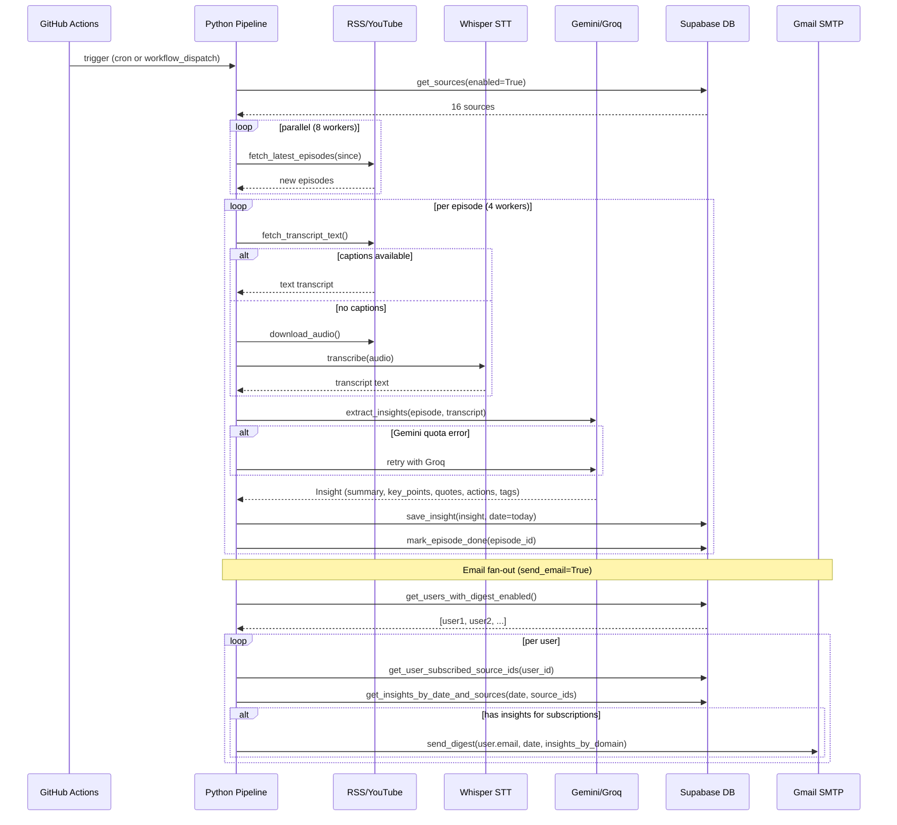

---

## 2. Public Dashboard Request (guest)

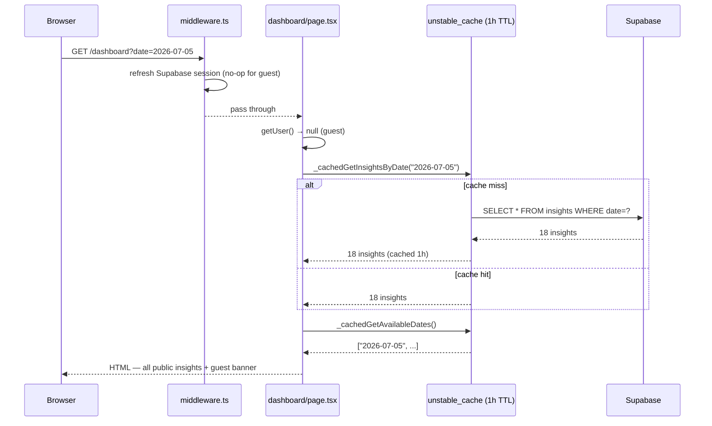

---

## 3. Authenticated Dashboard Request (personalized)

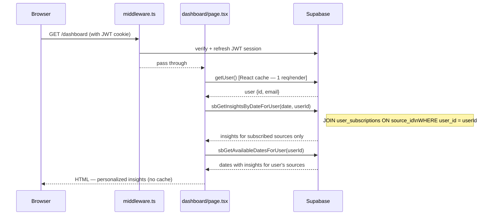

---

## 4. Register

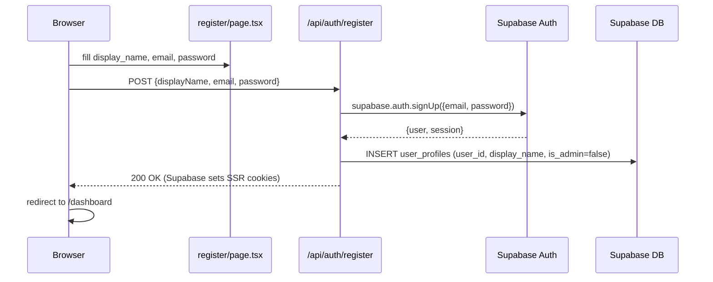

---

## 5. Login / Logout

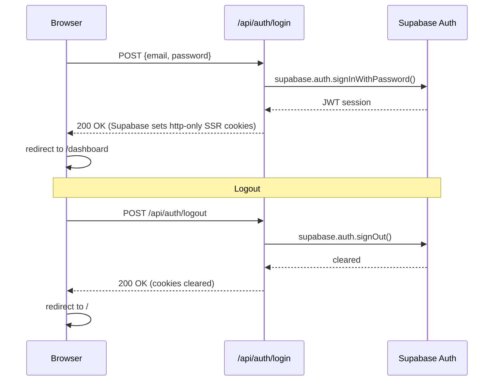

---

## 6. Subscribe / Unsubscribe (optimistic)

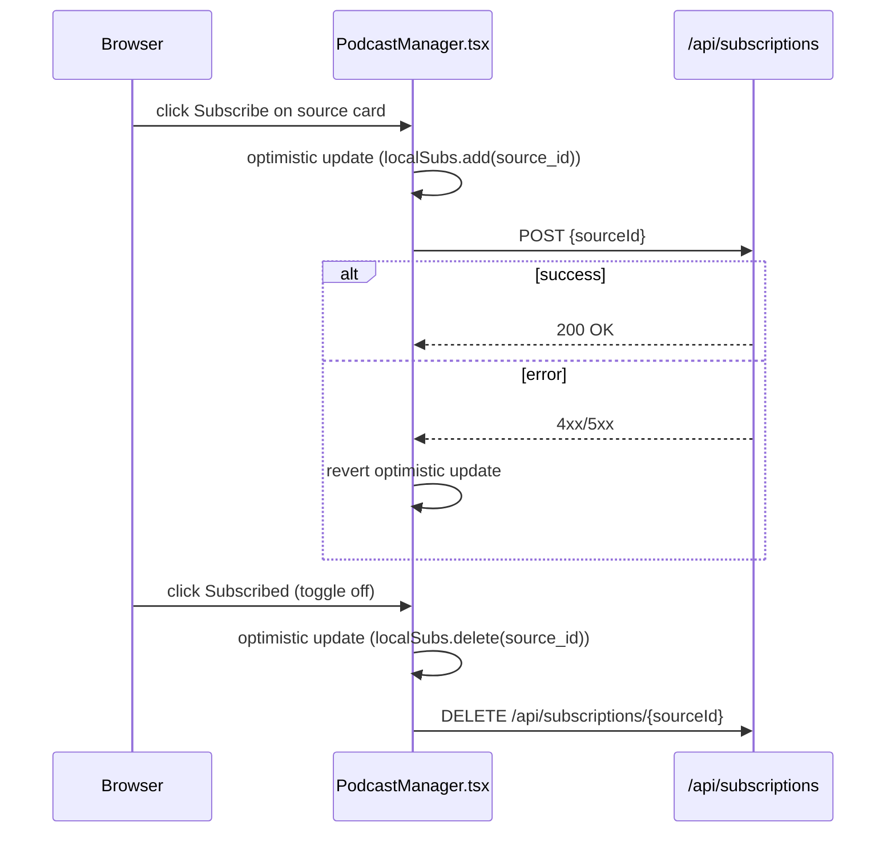

---

## 7. Profile Update

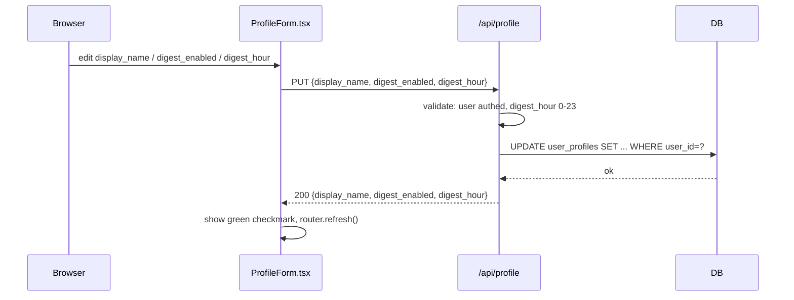

---

## 8. On-Demand Digest Send (Profile page)

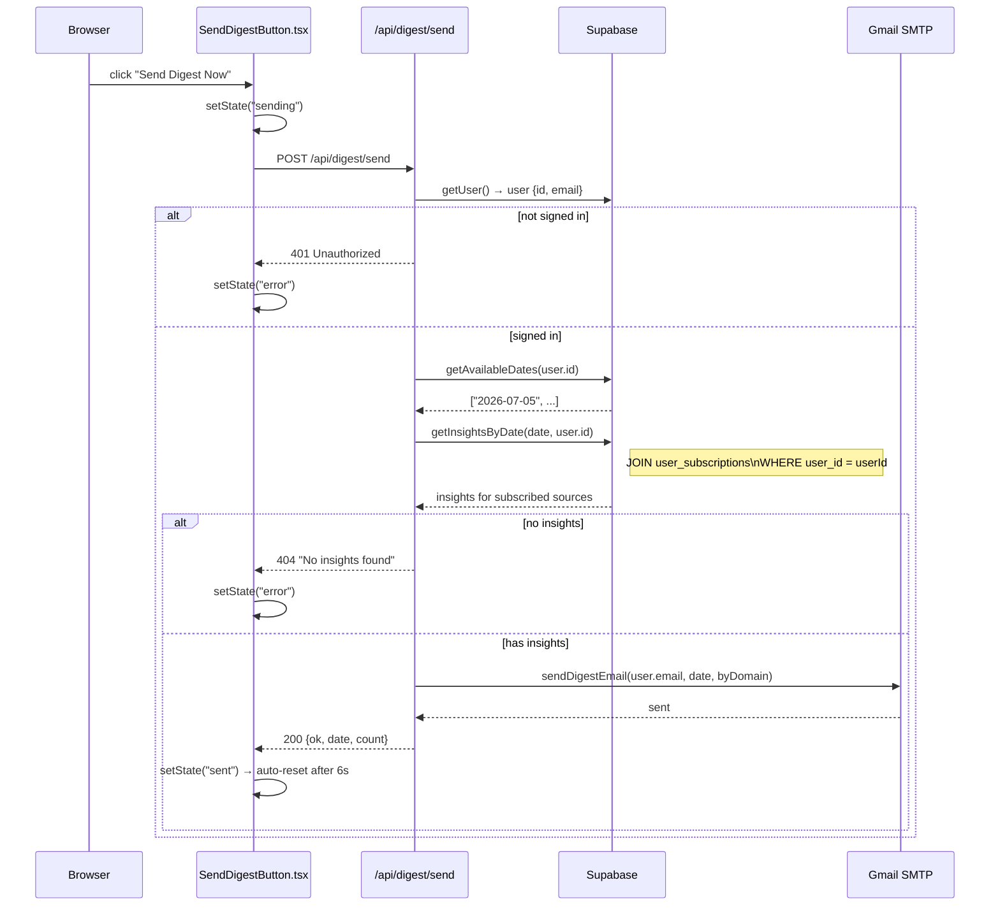

---

## 9. Episode Digest — Phase 1 (processed episode, fast path)

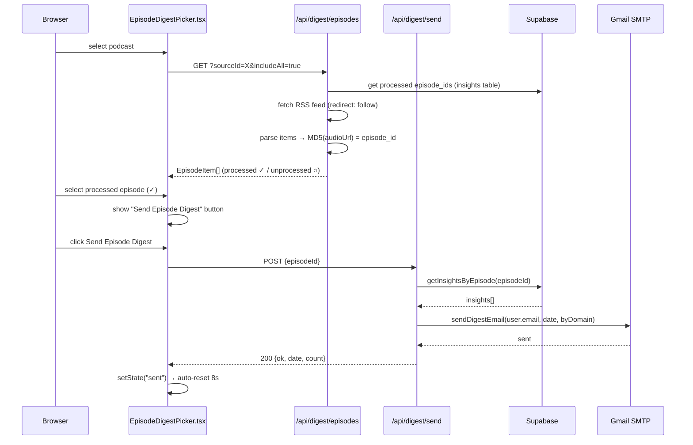

---

## 10. Episode Digest — Phase 2 (unprocessed episode, slow path)

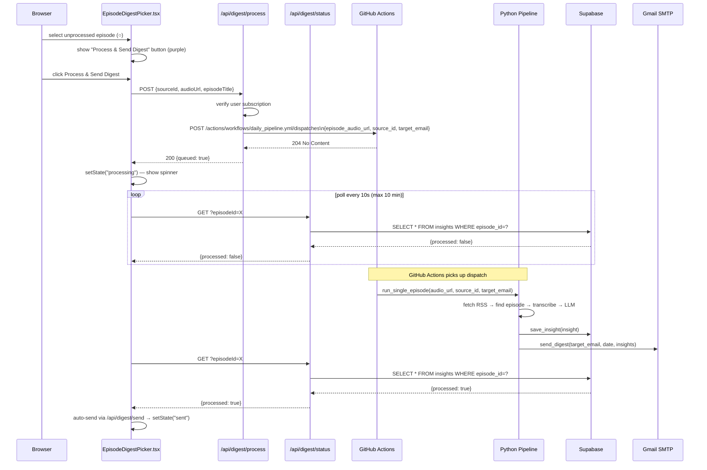

---

## 11. Admin Source Management

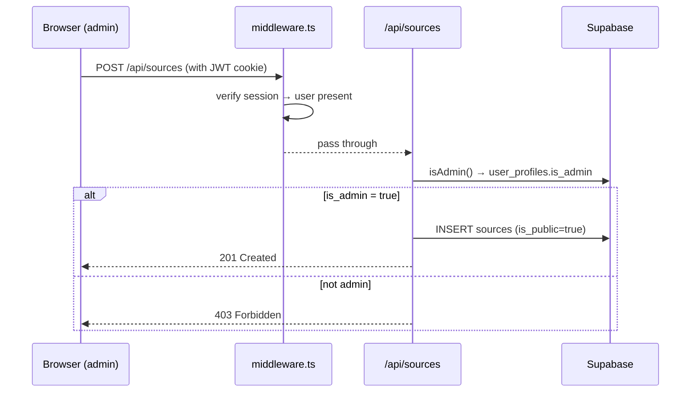
