# Request Workflow Diagrams

## 1. Pipeline — GitHub Actions → Supabase → Gmail

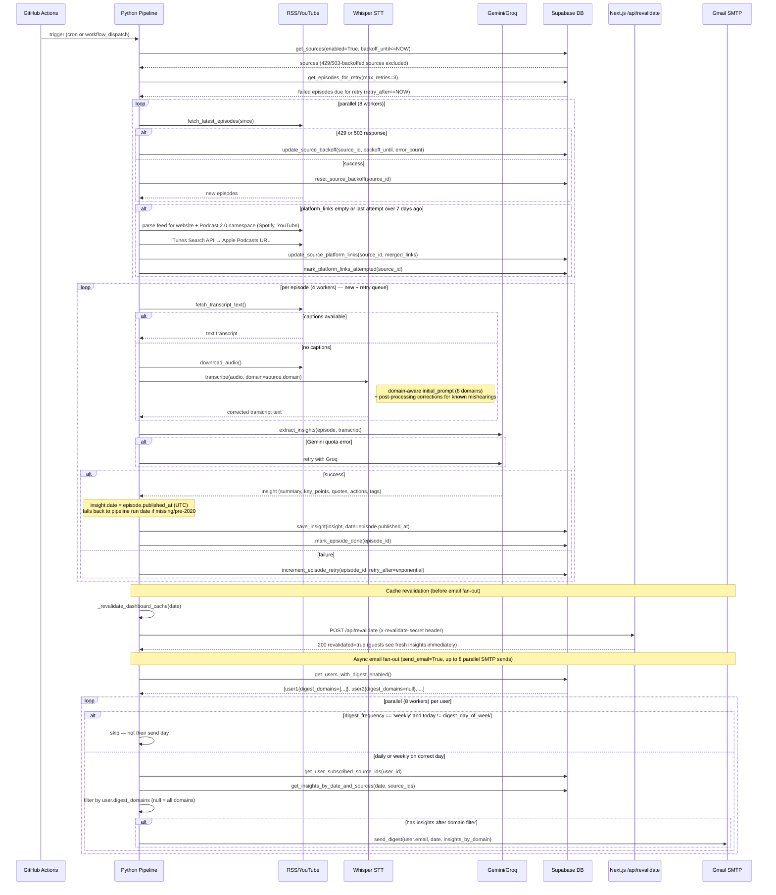
```mermaid
sequenceDiagram
    participant GH as GitHub Actions
    participant PY as Python Pipeline
    participant RSS as RSS/YouTube
    participant W as Whisper STT
    participant LLM as Gemini/Groq
    participant DB as Supabase DB
    participant NEXT as Next.js /api/revalidate
    participant MAIL as Gmail SMTP

    GH->>PY: trigger (cron or workflow_dispatch)
    PY->>DB: get_sources(enabled=True, backoff_until<=NOW)
    DB-->>PY: sources (429/503-backoffed sources excluded)
    PY->>DB: get_episodes_for_retry(max_retries=3)
    DB-->>PY: failed episodes due for retry (retry_after<=NOW)

    loop parallel (8 workers)
        PY->>RSS: fetch_latest_episodes(since)
        alt 429 or 503 response
            PY->>DB: update_source_backoff(source_id, backoff_until, error_count)
        else success
            PY->>DB: reset_source_backoff(source_id)
            RSS-->>PY: new episodes
        end
        alt platform_links empty or last attempt over 7 days ago
            PY->>RSS: parse feed for website + Podcast 2.0 namespace (Spotify, YouTube)
            PY->>RSS: iTunes Search API → Apple Podcasts URL
            PY->>DB: update_source_platform_links(source_id, merged_links)
            PY->>DB: mark_platform_links_attempted(source_id)
        end
    end

    loop per episode (4 workers) — new + retry queue
        PY->>RSS: fetch_transcript_text()
        alt captions available
            RSS-->>PY: text transcript
        else no captions
            PY->>RSS: download_audio()
            PY->>W: transcribe(audio, domain=source.domain)
            Note right of W: domain-aware initial_prompt (8 domains)<br/>+ post-processing corrections for known mishearings
            W-->>PY: corrected transcript text
        end
        PY->>LLM: extract_insights(episode, transcript)
        alt Gemini quota error
            PY->>LLM: retry with Groq
        end
        alt success
            LLM-->>PY: Insight (summary, key_points, quotes, actions, tags)
            Note over PY: insight.date = episode.published_at (UTC)<br/>falls back to pipeline run date if missing/pre-2020
            PY->>DB: save_insight(insight, date=episode.published_at)
            PY->>DB: mark_episode_done(episode_id)
        else failure
            PY->>DB: increment_episode_retry(episode_id, retry_after=exponential)
        end
    end

    Note over PY,MAIL: Cache revalidation (before email fan-out)
    PY->>PY: _revalidate_dashboard_cache(date)
    PY->>NEXT: POST /api/revalidate (x-revalidate-secret header)
    NEXT-->>PY: 200 revalidated=true (guests see fresh insights immediately)

    Note over PY,MAIL: Async email fan-out (send_email=True, up to 8 parallel SMTP sends)
    PY->>DB: get_users_with_digest_enabled()
    DB-->>PY: [user1{digest_domains=[...]}, user2{digest_domains=null}, ...]
    loop parallel (8 workers) per user
        alt digest_frequency == 'weekly' and today != digest_day_of_week
            PY->>PY: skip — not their send day
        else daily or weekly on correct day
            PY->>DB: get_user_subscribed_source_ids(user_id)
            PY->>DB: get_insights_by_date_and_sources(date, source_ids)
            PY->>PY: filter by user.digest_domains (null = all domains)
            alt has insights after domain filter
                PY->>MAIL: send_digest(user.email, date, insights_by_domain)
            end
        end
    end
```

---

## 2. Public Dashboard Request (guest)

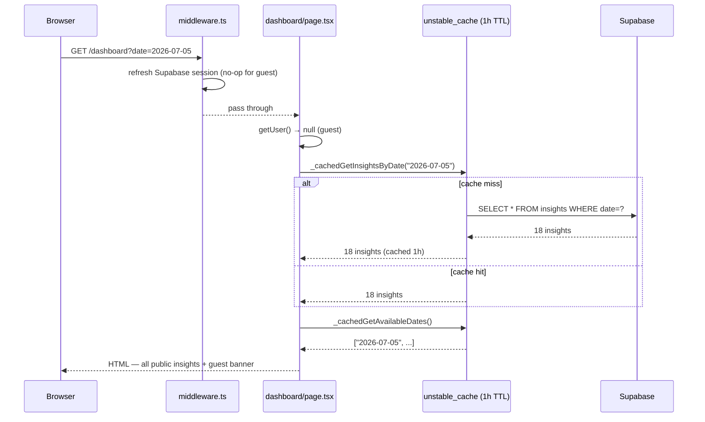
```mermaid
sequenceDiagram
    participant B as Browser
    participant MW as middleware.ts
    participant PAGE as dashboard/page.tsx
    participant CACHE as unstable_cache (1h TTL)
    participant DB as Supabase

    B->>MW: GET /dashboard?date=2026-07-05
    MW->>MW: refresh Supabase session (no-op for guest)
    MW-->>PAGE: pass through
    PAGE->>PAGE: getUser() → null (guest)
    PAGE->>CACHE: _cachedGetInsightsByDate("2026-07-05")
    alt cache miss
        CACHE->>DB: SELECT * FROM insights WHERE date=?
        DB-->>CACHE: 18 insights
        CACHE-->>PAGE: 18 insights (cached 1h)
    else cache hit
        CACHE-->>PAGE: 18 insights
    end
    PAGE->>CACHE: _cachedGetAvailableDates()
    CACHE-->>PAGE: ["2026-07-05", ...]
    PAGE-->>B: HTML — all public insights + guest banner
```

---

## 3. Authenticated Dashboard Request (personalized)

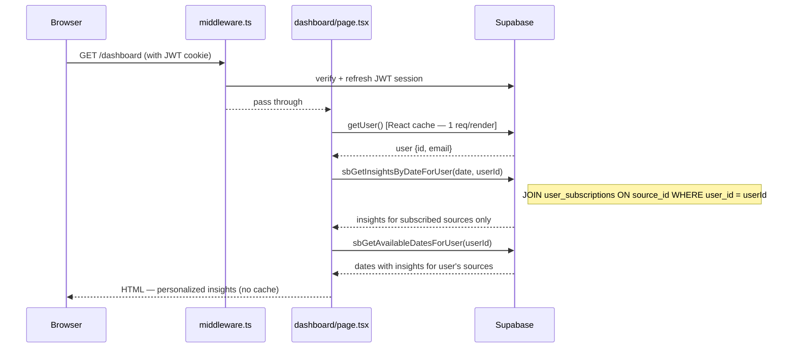
```mermaid
sequenceDiagram
    participant B as Browser
    participant MW as middleware.ts
    participant PAGE as dashboard/page.tsx
    participant DB as Supabase

    B->>MW: GET /dashboard (with JWT cookie)
    MW->>DB: verify + refresh JWT session
    MW-->>PAGE: pass through
    PAGE->>DB: getUser() [React cache — 1 req/render]
    DB-->>PAGE: user {id, email}
    PAGE->>DB: sbGetInsightsByDateForUser(date, userId)
    Note right of DB: JOIN user_subscriptions ON source_id WHERE user_id = userId
    DB-->>PAGE: insights for subscribed sources only
    PAGE->>DB: sbGetAvailableDatesForUser(userId)
    DB-->>PAGE: dates with insights for user's sources
    PAGE-->>B: HTML — personalized insights (no cache)
```

---

## 4. Register

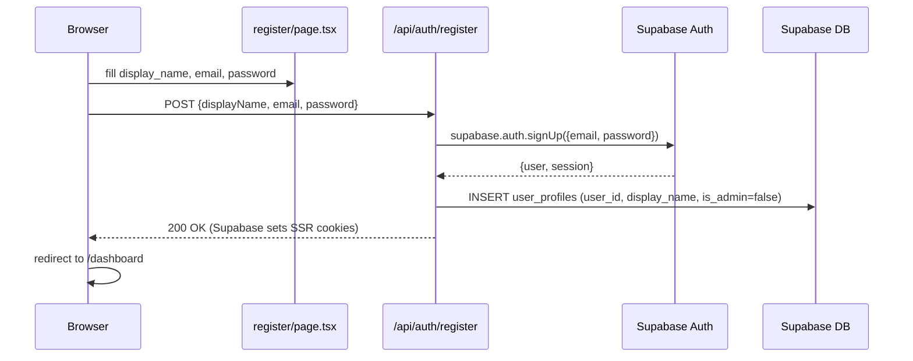
```mermaid
sequenceDiagram
    participant B as Browser
    participant PAGE as register/page.tsx
    participant API as /api/auth/register
    participant SB as Supabase Auth
    participant DB as Supabase DB

    B->>PAGE: fill display_name, email, password
    B->>API: POST {displayName, email, password}
    API->>SB: supabase.auth.signUp({email, password})
    SB-->>API: {user, session}
    API->>DB: INSERT user_profiles (user_id, display_name, is_admin=false)
    API-->>B: 200 OK (Supabase sets SSR cookies)
    B->>B: redirect to /dashboard
```

---

## 5. Login / Logout

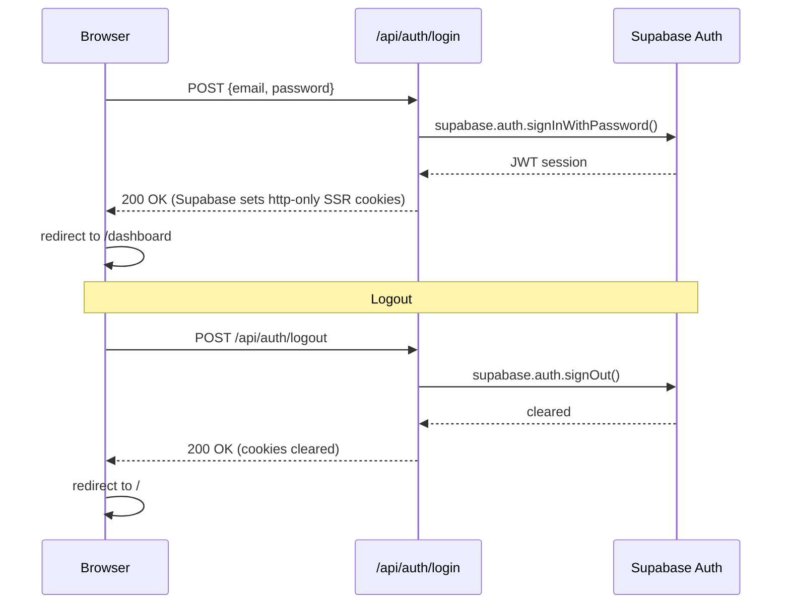
```mermaid
sequenceDiagram
    participant B as Browser
    participant API as /api/auth/login
    participant SB as Supabase Auth

    B->>API: POST {email, password}
    API->>SB: supabase.auth.signInWithPassword()
    SB-->>API: JWT session
    API-->>B: 200 OK (Supabase sets http-only SSR cookies)
    B->>B: redirect to /dashboard

    Note over B,SB: Logout
    B->>API: POST /api/auth/logout
    API->>SB: supabase.auth.signOut()
    SB-->>API: cleared
    API-->>B: 200 OK (cookies cleared)
    B->>B: redirect to /
```

---

## 6. Subscribe / Unsubscribe (optimistic)

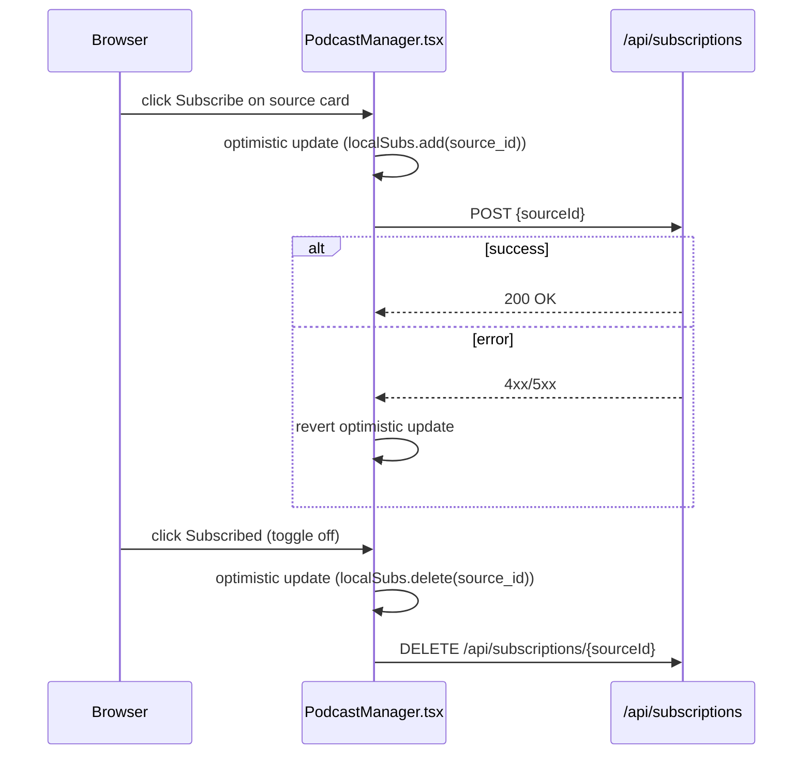
```mermaid
sequenceDiagram
    participant B as Browser
    participant PM as PodcastManager.tsx
    participant API as /api/subscriptions

    B->>PM: click Subscribe on source card
    PM->>PM: optimistic update (localSubs.add(source_id))
    PM->>API: POST {sourceId}
    alt success
        API-->>PM: 200 OK
    else error
        API-->>PM: 4xx/5xx
        PM->>PM: revert optimistic update
    end

    B->>PM: click Subscribed (toggle off)
    PM->>PM: optimistic update (localSubs.delete(source_id))
    PM->>API: DELETE /api/subscriptions/{sourceId}
```

---

## 7. Profile Update

```mermaid
sequenceDiagram
    participant B as Browser
    participant FORM as ProfileForm.tsx
    participant API as /api/profile

    B->>FORM: edit display_name / digest_enabled / digest_hour / digest_domains / digest_frequency / digest_day_of_week
    FORM->>API: PUT {display_name, digest_enabled, digest_hour, digest_domains, digest_frequency, digest_day_of_week}
    Note right of API: digest_domains: string[] or null; digest_frequency: 'daily'|'weekly'; digest_day_of_week: 0–6
    API->>API: validate: user authed, digest_hour 0-23, digest_frequency in ['daily','weekly'], digest_day_of_week 0-6
    API->>DB: UPDATE user_profiles SET ... WHERE user_id=?
    DB-->>API: ok
    API-->>FORM: 200 ok
    FORM->>FORM: show green checkmark, router.refresh()
```

---

## 8. On-Demand Digest Send (Profile page)

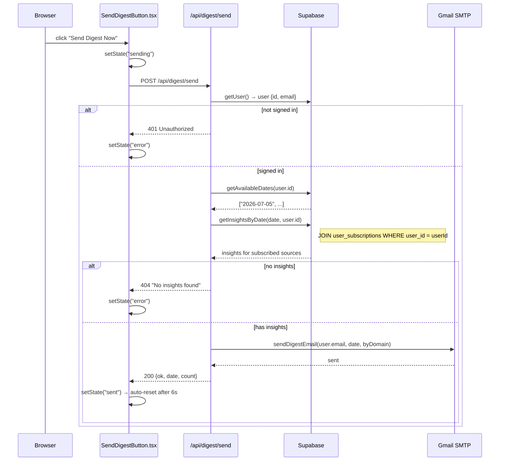
```mermaid
sequenceDiagram
    participant B as Browser
    participant BTN as SendDigestButton.tsx
    participant API as /api/digest/send
    participant DB as Supabase
    participant MAIL as Gmail SMTP

    B->>BTN: click "Send Digest Now"
    BTN->>BTN: setState("sending")
    BTN->>API: POST /api/digest/send
    API->>DB: getUser() → user {id, email}
    alt not signed in
        API-->>BTN: 401 Unauthorized
        BTN->>BTN: setState("error")
    else signed in
        API->>DB: getAvailableDates(user.id)
        DB-->>API: ["2026-07-05", ...]
        API->>DB: getInsightsByDate(date, user.id)
        Note right of DB: JOIN user_subscriptions WHERE user_id = userId
        DB-->>API: insights for subscribed sources
        alt no insights
            API-->>BTN: 404 "No insights found"
            BTN->>BTN: setState("error")
        else has insights
            API->>MAIL: sendDigestEmail(user.email, date, byDomain)
            MAIL-->>API: sent
            API-->>BTN: 200 {ok, date, count}
            BTN->>BTN: setState("sent") → auto-reset after 6s
        end
    end
```

---

## 9. Episode Digest — Phase 1 (processed episode, fast path)

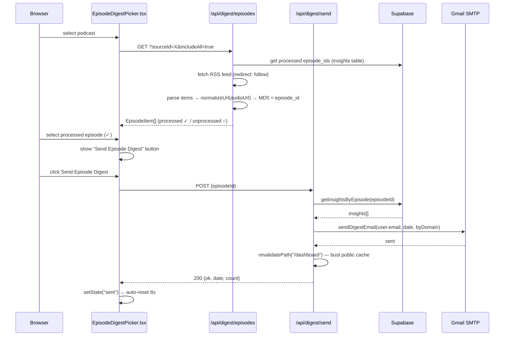
```mermaid
sequenceDiagram
    participant B as Browser
    participant PICKER as EpisodeDigestPicker.tsx
    participant EAPI as /api/digest/episodes
    participant SAPI as /api/digest/send
    participant DB as Supabase
    participant MAIL as Gmail SMTP

    B->>PICKER: select podcast
    PICKER->>EAPI: GET ?sourceId=X&includeAll=true
    EAPI->>DB: get processed episode_ids (insights table)
    EAPI->>EAPI: fetch RSS feed (redirect: follow)
    EAPI->>EAPI: parse items → normalizeUrl(audioUrl) → MD5 = episode_id
    EAPI-->>PICKER: EpisodeItem[] (processed ✓ / unprocessed ○)

    B->>PICKER: select processed episode (✓)
    PICKER->>PICKER: show "Send Episode Digest" button

    B->>PICKER: click Send Episode Digest
    PICKER->>SAPI: POST {episodeId}
    SAPI->>DB: getInsightsByEpisode(episodeId)
    DB-->>SAPI: insights[]
    SAPI->>MAIL: sendDigestEmail(user.email, date, byDomain)
    MAIL-->>SAPI: sent
    SAPI->>SAPI: revalidatePath("/dashboard") — bust public cache
    SAPI-->>PICKER: 200 {ok, date, count}
    PICKER->>PICKER: setState("sent") → auto-reset 8s
```

---

## 10. Episode Digest — Phase 2 (unprocessed episode, async fire-and-forget)

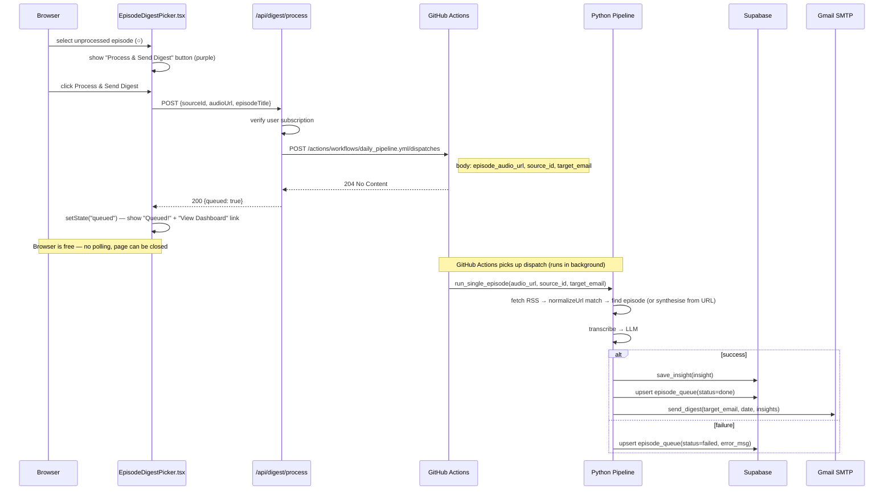
```mermaid
sequenceDiagram
    participant B as Browser
    participant PICKER as EpisodeDigestPicker.tsx
    participant PAPI as /api/digest/process
    participant GH as GitHub Actions
    participant PY as Python Pipeline
    participant DB as Supabase
    participant MAIL as Gmail SMTP

    B->>PICKER: select unprocessed episode (○)
    PICKER->>PICKER: show "Process & Send Digest" button (purple)

    B->>PICKER: click Process & Send Digest
    PICKER->>PAPI: POST {sourceId, audioUrl, episodeTitle}
    PAPI->>PAPI: verify user subscription
    PAPI->>GH: POST /actions/workflows/daily_pipeline.yml/dispatches
    Note right of GH: body: episode_audio_url, source_id, target_email
    GH-->>PAPI: 204 No Content
    PAPI-->>PICKER: 200 {queued: true}
    PICKER->>PICKER: setState("queued") — show "Queued!" + "View Dashboard" link
    Note over B,PICKER: Browser is free — no polling, page can be closed

    Note over GH,PY: GitHub Actions picks up dispatch (runs in background)
    GH->>PY: run_single_episode(audio_url, source_id, target_email)
    PY->>PY: fetch RSS → normalizeUrl match → find episode (or synthesise from URL)
    PY->>PY: transcribe → LLM
    alt success
        PY->>DB: save_insight(insight)
        PY->>DB: upsert episode_queue(status=done)
        PY->>MAIL: send_digest(target_email, date, insights)
    else failure
        PY->>DB: upsert episode_queue(status=failed, error_msg)
    end
```

---

## 11. Episode Digest — Live Update via Supabase Realtime

When the profile page is open and an episode is queued, the browser subscribes to Supabase Realtime. The ⏳ flips to ✓ the moment the pipeline writes the insight row — no polling, no page refresh.

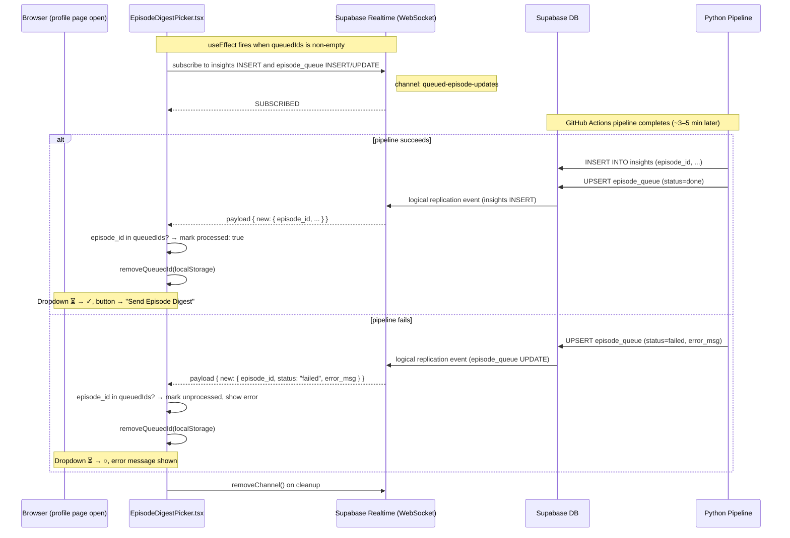
```mermaid
sequenceDiagram
    participant B as Browser (profile page open)
    participant PICKER as EpisodeDigestPicker.tsx
    participant RT as Supabase Realtime (WebSocket)
    participant DB as Supabase DB
    participant PY as Python Pipeline

    Note over PICKER,RT: useEffect fires when queuedIds is non-empty
    PICKER->>RT: subscribe to insights INSERT and episode_queue INSERT/UPDATE
    Note right of RT: channel: queued-episode-updates
    RT-->>PICKER: SUBSCRIBED

    Note over PY,DB: GitHub Actions pipeline completes (~3–5 min later)
    alt pipeline succeeds
        PY->>DB: INSERT INTO insights (episode_id, ...)
        PY->>DB: UPSERT episode_queue (status=done)
        DB->>RT: logical replication event (insights INSERT)
        RT-->>PICKER: payload { new: { episode_id, ... } }
        PICKER->>PICKER: episode_id in queuedIds? → mark processed: true
        PICKER->>PICKER: removeQueuedId(localStorage)
        Note over B,PICKER: Dropdown ⏳ → ✓, button → "Send Episode Digest"
    else pipeline fails
        PY->>DB: UPSERT episode_queue (status=failed, error_msg)
        DB->>RT: logical replication event (episode_queue UPDATE)
        RT-->>PICKER: payload { new: { episode_id, status: "failed", error_msg } }
        PICKER->>PICKER: episode_id in queuedIds? → mark unprocessed, show error
        PICKER->>PICKER: removeQueuedId(localStorage)
        Note over B,PICKER: Dropdown ⏳ → ○, error message shown
    end
    PICKER->>RT: removeChannel() on cleanup
```

---

## 12. Add Podcast (Authenticated Source Management)

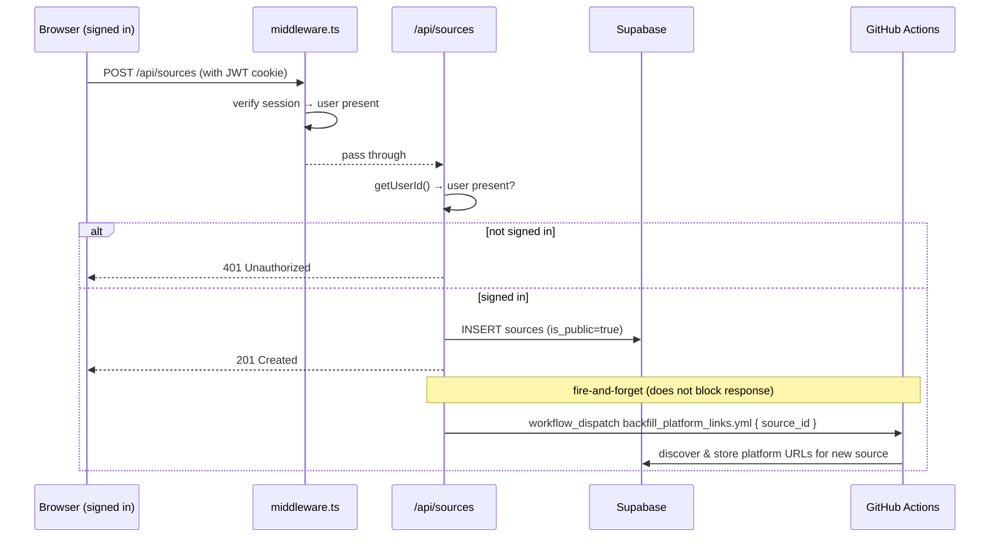
```mermaid
sequenceDiagram
    participant B as Browser (signed in)
    participant MW as middleware.ts
    participant API as /api/sources
    participant DB as Supabase
    participant GH as GitHub Actions

    B->>MW: POST /api/sources (with JWT cookie)
    MW->>MW: verify session → user present
    MW-->>API: pass through
    API->>API: getUserId() → user present?
    alt not signed in
        API-->>B: 401 Unauthorized
    else signed in
        API->>DB: INSERT sources (is_public=true)
        API-->>B: 201 Created
        Note over API,GH: fire-and-forget (does not block response)
        API->>GH: workflow_dispatch backfill_platform_links.yml { source_id }
        GH->>DB: discover & store platform URLs for new source
    end
```

## 13. Admin Domain Reclassification

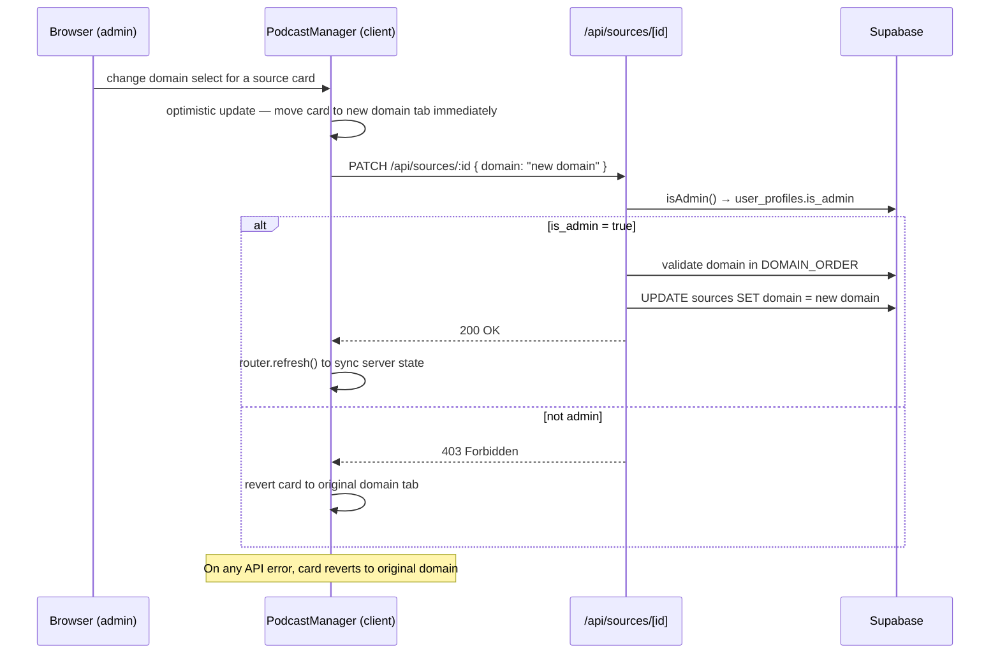
```mermaid
sequenceDiagram
    participant B as Browser (admin)
    participant PM as PodcastManager (client)
    participant API as /api/sources/[id]
    participant DB as Supabase

    B->>PM: change domain select for a source card
    PM->>PM: optimistic update — move card to new domain tab immediately
    PM->>API: PATCH /api/sources/:id { domain: "new domain" }
    API->>DB: isAdmin() → user_profiles.is_admin
    alt is_admin = true
        API->>DB: validate domain in DOMAIN_ORDER
        API->>DB: UPDATE sources SET domain = new domain
        API-->>PM: 200 OK
        PM->>PM: router.refresh() to sync server state
    else not admin
        API-->>PM: 403 Forbidden
        PM->>PM: revert card to original domain tab
    end
    Note over PM: On any API error, card reverts to original domain
```

---

## 14. Insight Card Engagement — Views, Reactions, Comments, Share

> Supabase is required for all engagement features in both local dev and production.

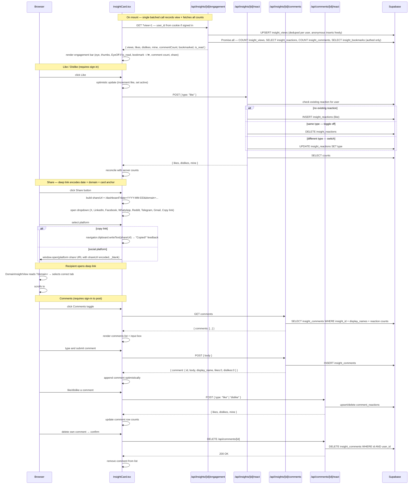
```mermaid
sequenceDiagram
    participant B as Browser
    participant CARD as InsightCard.tsx
    participant EAPI as /api/insights/[id]/engagement
    participant RAPI as /api/insights/[id]/react
    participant CAPI as /api/insights/[id]/comments
    participant CRAPI as /api/comments/[id]/react
    participant DB as Supabase

    Note over CARD,EAPI: On mount — single batched call records view + fetches all counts
    CARD->>EAPI: GET ?view=1 — user_id from cookie if signed in
    EAPI->>DB: UPSERT insight_views (deduped per user, anonymous inserts freely)
    EAPI->>DB: Promise.all — COUNT insight_views, SELECT insight_reactions, COUNT insight_comments, SELECT insight_bookmarks (authed only)
    EAPI-->>CARD: { views, likes, dislikes, mine, commentCount, bookmarked, is_read }
    CARD->>CARD: render engagement bar (eye, thumbs, EyeOff if is_read, bookmark ☆/★, comment count, share)

    Note over B,CARD: Like / Dislike (requires sign-in)
    B->>CARD: click Like
    CARD->>CARD: optimistic update (increment like, set active)
    CARD->>RAPI: POST { type: "like" }
    RAPI->>DB: check existing reaction for user
    alt no existing reaction
        RAPI->>DB: INSERT insight_reactions (like)
    else same type — toggle off
        RAPI->>DB: DELETE insight_reactions
    else different type — switch
        RAPI->>DB: UPDATE insight_reactions SET type
    end
    RAPI->>DB: SELECT counts
    RAPI-->>CARD: { likes, dislikes, mine }
    CARD->>CARD: reconcile with server counts

    Note over B,CARD: Share — deep link encodes date + domain + card anchor
    B->>CARD: click Share button
    CARD->>CARD: build shareUrl = /dashboard?date=YYYY-MM-DD&domain=...#insight-{id}
    CARD->>CARD: open dropdown (X, LinkedIn, Facebook, WhatsApp, Reddit, Telegram, Gmail, Copy link)
    B->>CARD: select platform
    alt copy link
        CARD->>CARD: navigator.clipboard.writeText(shareUrl) → "Copied!" feedback
    else social platform
        CARD->>B: window.open(platform share URL with shareUrl encoded, _blank)
    end
    Note over B,CARD: Recipient opens deep link
    B->>B: DomainInsightView reads ?domain= → selects correct tab
    B->>B: scrolls to #insight-{id} → card centred in viewport

    Note over B,CARD: Comments (requires sign-in to post)
    B->>CARD: click Comments toggle
    CARD->>CAPI: GET comments
    CAPI->>DB: SELECT insight_comments WHERE insight_id + display_names + reaction counts
    CAPI-->>CARD: { comments: [...] }
    CARD->>CARD: render comments list + input box

    B->>CARD: type and submit comment
    CARD->>CAPI: POST { body }
    CAPI->>DB: INSERT insight_comments
    CAPI-->>CARD: { comment: { id, body, display_name, likes:0, dislikes:0 } }
    CARD->>CARD: append comment optimistically

    B->>CARD: like/dislike a comment
    CARD->>CRAPI: POST { type: "like" | "dislike" }
    CRAPI->>DB: upsert/delete comment_reactions
    CRAPI-->>CARD: { likes, dislikes, mine }
    CARD->>CARD: update comment row counts

    B->>CARD: delete own comment → confirm
    CARD->>CRAPI: DELETE /api/comments/[id]
    CRAPI->>DB: DELETE insight_comments WHERE id AND user_id
    CRAPI-->>CARD: 200 OK
    CARD->>CARD: remove comment from list
```

---

## 15. Full-Text Search (Cmd+K / Ctrl+K overlay) with Filters

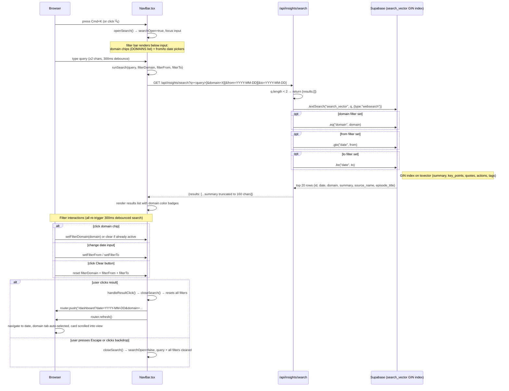
```mermaid
sequenceDiagram
    participant B as Browser
    participant NAV as NavBar.tsx
    participant API as /api/insights/search
    participant DB as Supabase (search_vector GIN index)

    B->>NAV: press Cmd+K (or click 🔍)
    NAV->>NAV: openSearch() → searchOpen=true, focus input
    Note over NAV: filter bar renders below input:<br/>domain chips (DOMAINS list) + from/to date pickers

    B->>NAV: type query (≥2 chars, 300ms debounce)
    NAV->>NAV: runSearch(query, filterDomain, filterFrom, filterTo)
    NAV->>API: GET /api/insights/search?q=<query>[&domain=X][&from=YYYY-MM-DD][&to=YYYY-MM-DD]
    API->>API: q.length < 2 → return {results:[]}
    API->>DB: .textSearch("search_vector", q, {type:"websearch"})
    opt domain filter set
        API->>DB: .eq("domain", domain)
    end
    opt from filter set
        API->>DB: .gte("date", from)
    end
    opt to filter set
        API->>DB: .lte("date", to)
    end
    Note right of DB: GIN index on tsvector (summary, key_points, quotes, actions, tags)
    DB-->>API: top 20 rows (id, date, domain, summary, source_name, episode_title)
    API-->>NAV: {results: [...summary truncated to 160 chars]}
    NAV->>NAV: render results list with domain color badges

    Note over B,NAV: Filter interactions (all re-trigger 300ms debounced search)
    alt click domain chip
        B->>NAV: setFilterDomain(domain) or clear if already active
    else change date input
        B->>NAV: setFilterFrom / setFilterTo
    else click Clear button
        B->>NAV: reset filterDomain + filterFrom + filterTo
    end

    alt user clicks result
        NAV->>NAV: handleResultClick() → closeSearch() → resets all filters
        NAV->>B: router.push("/dashboard?date=YYYY-MM-DD&domain=...#insight-{id}")
        NAV->>B: router.refresh()
        B->>B: navigate to date, domain tab auto-selected, card scrolled into view
    else user presses Escape or clicks backdrop
        NAV->>NAV: closeSearch() → searchOpen=false, query + all filters cleared
    end
```

---

## 16. Digest Email Preview

```mermaid
sequenceDiagram
    participant B as Browser
    participant BTN as SendDigestButton.tsx
    participant API as /api/digest/preview
    participant DB as Supabase

    B->>BTN: click "Preview"
    BTN->>B: window.open("/api/digest/preview", "_blank")
    B->>API: GET /api/digest/preview
    API->>DB: getUser() → user {id, email}
    alt not signed in
        API-->>B: 401 Unauthorized
    else signed in
        API->>DB: getAvailableDates(user.id)
        API->>DB: getInsightsByDate(date, user.id)
        Note right of DB: same query as /api/digest/send; same HTML the email renders
        API->>API: buildDigestHtml(date, byDomain)
        API-->>B: 200 text/html — rendered email in browser tab
    end
```

---

## 17. Export Insights (PDF / Word / CSV / JSON)

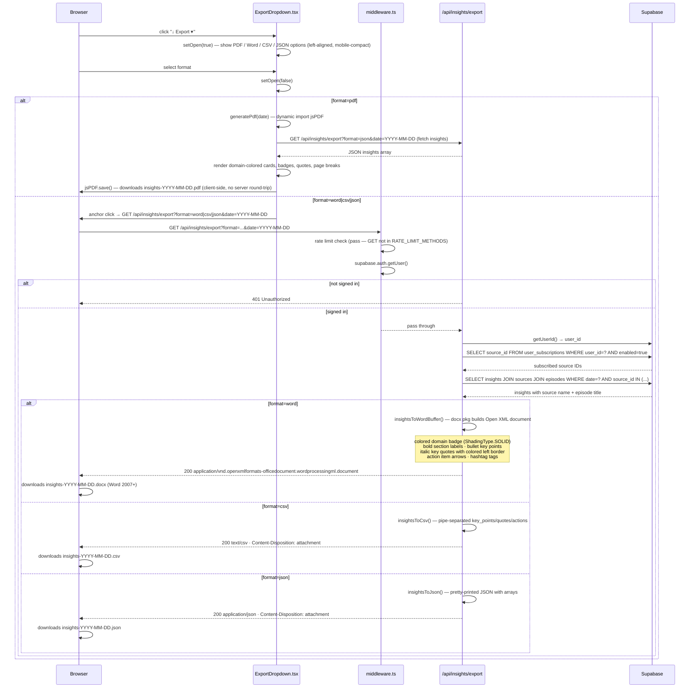
```mermaid
sequenceDiagram
    participant B as Browser
    participant DD as ExportDropdown.tsx
    participant MW as middleware.ts
    participant API as /api/insights/export
    participant DB as Supabase

    B->>DD: click "↓ Export ▾"
    DD->>DD: setOpen(true) — show PDF / Word / CSV / JSON options (left-aligned, mobile-compact)

    B->>DD: select format
    DD->>DD: setOpen(false)

    alt format=pdf
        DD->>DD: generatePdf(date) — dynamic import jsPDF
        DD->>API: GET /api/insights/export?format=json&date=YYYY-MM-DD (fetch insights)
        API-->>DD: JSON insights array
        DD->>DD: render domain-colored cards, badges, quotes, page breaks
        DD->>B: jsPDF.save() — downloads insights-YYYY-MM-DD.pdf (client-side, no server round-trip)
    else format=word|csv|json
        DD->>B: anchor click → GET /api/insights/export?format=word|csv|json&date=YYYY-MM-DD

        B->>MW: GET /api/insights/export?format=...&date=YYYY-MM-DD
        MW->>MW: rate limit check (pass — GET not in RATE_LIMIT_METHODS)
        MW->>MW: supabase.auth.getUser()
        alt not signed in
            API-->>B: 401 Unauthorized
        else signed in
            MW-->>API: pass through
            API->>DB: getUserId() → user_id
            API->>DB: SELECT source_id FROM user_subscriptions WHERE user_id=? AND enabled=true
            DB-->>API: subscribed source IDs
            API->>DB: SELECT insights JOIN sources JOIN episodes WHERE date=? AND source_id IN (...)
            DB-->>API: insights with source name + episode title

            alt format=word
                API->>API: insightsToWordBuffer() — docx pkg builds Open XML document
                Note over API: colored domain badge (ShadingType.SOLID)<br/>bold section labels · bullet key points<br/>italic key quotes with colored left border<br/>action item arrows · hashtag tags
                API-->>B: 200 application/vnd.openxmlformats-officedocument.wordprocessingml.document
                B->>B: downloads insights-YYYY-MM-DD.docx (Word 2007+)
            else format=csv
                API->>API: insightsToCsv() — pipe-separated key_points/quotes/actions
                API-->>B: 200 text/csv · Content-Disposition: attachment
                B->>B: downloads insights-YYYY-MM-DD.csv
            else format=json
                API->>API: insightsToJson() — pretty-printed JSON with arrays
                API-->>B: 200 application/json · Content-Disposition: attachment
                B->>B: downloads insights-YYYY-MM-DD.json
            end
        end
    end
```

---

## 18. Analytics Dashboard

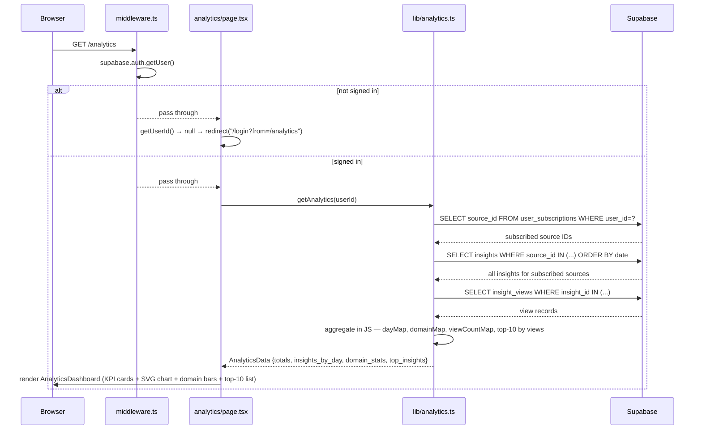
```mermaid
sequenceDiagram
    participant B as Browser
    participant MW as middleware.ts
    participant PAGE as analytics/page.tsx
    participant LIB as lib/analytics.ts
    participant DB as Supabase

    B->>MW: GET /analytics
    MW->>MW: supabase.auth.getUser()
    alt not signed in
        MW-->>PAGE: pass through
        PAGE->>PAGE: getUserId() → null → redirect("/login?from=/analytics")
    else signed in
        MW-->>PAGE: pass through
        PAGE->>LIB: getAnalytics(userId)
        LIB->>DB: SELECT source_id FROM user_subscriptions WHERE user_id=?
        DB-->>LIB: subscribed source IDs
        LIB->>DB: SELECT insights WHERE source_id IN (...) ORDER BY date
        DB-->>LIB: all insights for subscribed sources
        LIB->>DB: SELECT insight_views WHERE insight_id IN (...)
        DB-->>LIB: view records
        LIB->>LIB: aggregate in JS — dayMap, domainMap, viewCountMap, top-10 by views
        LIB-->>PAGE: AnalyticsData {totals, insights_by_day, domain_stats, top_insights}
        PAGE->>B: render AnalyticsDashboard (KPI cards + SVG chart + domain bars + top-10 list)
    end
```

---

## 19. Bookmark Toggle (Save / Unsave Insight)

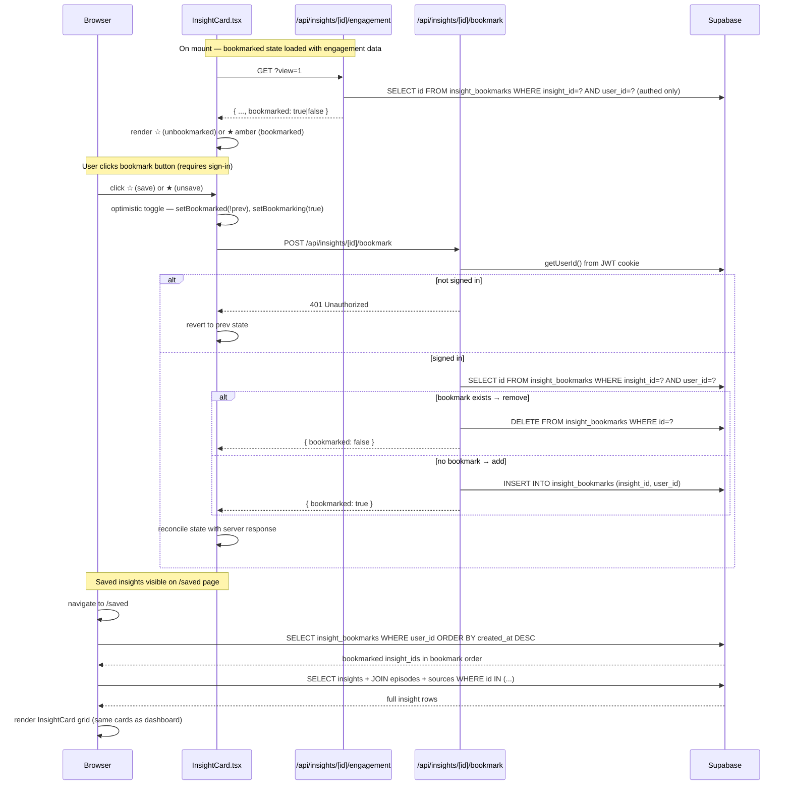
```mermaid
sequenceDiagram
    participant B as Browser
    participant CARD as InsightCard.tsx
    participant EAPI as /api/insights/[id]/engagement
    participant BAPI as /api/insights/[id]/bookmark
    participant DB as Supabase

    Note over CARD,EAPI: On mount — bookmarked state loaded with engagement data
    CARD->>EAPI: GET ?view=1
    EAPI->>DB: SELECT id FROM insight_bookmarks WHERE insight_id=? AND user_id=? (authed only)
    EAPI-->>CARD: { ..., bookmarked: true|false }
    CARD->>CARD: render ☆ (unbookmarked) or ★ amber (bookmarked)

    Note over B,CARD: User clicks bookmark button (requires sign-in)
    B->>CARD: click ☆ (save) or ★ (unsave)
    CARD->>CARD: optimistic toggle — setBookmarked(!prev), setBookmarking(true)

    CARD->>BAPI: POST /api/insights/[id]/bookmark
    BAPI->>DB: getUserId() from JWT cookie
    alt not signed in
        BAPI-->>CARD: 401 Unauthorized
        CARD->>CARD: revert to prev state
    else signed in
        BAPI->>DB: SELECT id FROM insight_bookmarks WHERE insight_id=? AND user_id=?
        alt bookmark exists → remove
            BAPI->>DB: DELETE FROM insight_bookmarks WHERE id=?
            BAPI-->>CARD: { bookmarked: false }
        else no bookmark → add
            BAPI->>DB: INSERT INTO insight_bookmarks (insight_id, user_id)
            BAPI-->>CARD: { bookmarked: true }
        end
        CARD->>CARD: reconcile state with server response
    end

    Note over B,CARD: Saved insights visible on /saved page
    B->>B: navigate to /saved
    B->>DB: SELECT insight_bookmarks WHERE user_id ORDER BY created_at DESC
    DB-->>B: bookmarked insight_ids in bookmark order
    B->>DB: SELECT insights + JOIN episodes + sources WHERE id IN (...)
    DB-->>B: full insight rows
    B->>B: render InsightCard grid (same cards as dashboard)
```

---

## 20. Realtime Dashboard Update

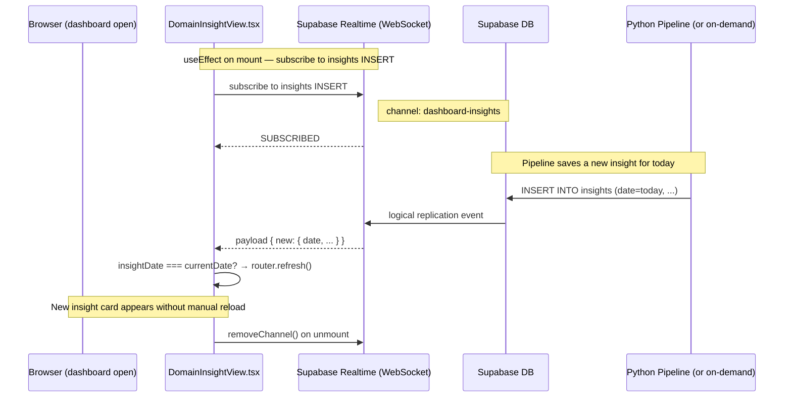
```mermaid
sequenceDiagram
    participant B as Browser (dashboard open)
    participant DIV as DomainInsightView.tsx
    participant RT as Supabase Realtime (WebSocket)
    participant DB as Supabase DB
    participant PY as Python Pipeline (or on-demand)

    Note over DIV,RT: useEffect on mount — subscribe to insights INSERT
    DIV->>RT: subscribe to insights INSERT
    Note right of RT: channel: dashboard-insights
    RT-->>DIV: SUBSCRIBED

    Note over PY,DB: Pipeline saves a new insight for today
    PY->>DB: INSERT INTO insights (date=today, ...)
    DB->>RT: logical replication event
    RT-->>DIV: payload { new: { date, ... } }
    DIV->>DIV: insightDate === currentDate? → router.refresh()
    Note over B,DIV: New insight card appears without manual reload
    DIV->>RT: removeChannel() on unmount
```

---

## 21. Onboarding Wizard (New User)

```mermaid
sequenceDiagram
    participant B as Browser
    participant MW as middleware.ts
    participant DASH as dashboard/page.tsx
    participant ONB as onboarding/page.tsx
    participant WIZ as OnboardingWizard (client)
    participant API as /api/recommendations/podcasts
    participant ITUNES as iTunes Search API
    participant DB as Supabase

    B->>MW: GET /dashboard (first login, JWT cookie)
    MW-->>DASH: pass through
    DASH->>DB: getUserSubscriptions(userId)
    DB-->>DASH: [] (no subscriptions yet)
    DASH-->>B: redirect /onboarding

    B->>MW: GET /onboarding
    MW-->>ONB: pass through
    ONB->>DB: getUserId() → userId
    ONB->>DB: getUserSubscriptions(userId)
    DB-->>ONB: [] → render wizard
    ONB-->>B: OnboardingWizard (Step 1: domain picker)

    Note over B,WIZ: Step 1 — User selects domains (e.g. "Technology & AI", "Finance")
    B->>WIZ: click Next (domains selected)

    WIZ->>API: GET /api/recommendations/podcasts?domains=Technology+%26+AI%2CFinance
    API->>DB: SELECT * FROM sources WHERE domain IN (...) AND enabled AND NOT deleted
    DB-->>API: catalog sources
    API->>ITUNES: search "artificial intelligence technology" (limit 8)
    ITUNES-->>API: iTunes results
    API->>ITUNES: search "finance investing personal finance" (limit 8)
    ITUNES-->>API: iTunes results
    API->>API: deduplicate iTunes results against catalog feedUrls
    API-->>WIZ: { catalog: [...], suggestions: [...] }

    Note over B,WIZ: Step 2 — User toggles subscribe on podcasts
    B->>WIZ: click Get Started

    loop per selected source
        WIZ->>DB: POST /api/subscriptions { sourceId }
        DB-->>WIZ: { ok: true }
    end
    WIZ->>DB: PUT /api/profile { digest_domains: selectedDomains }
    DB-->>WIZ: { ok: true }
    WIZ-->>B: redirect /dashboard
```

---

## 23. Hourly Digest Fan-Out (Timezone-Aware)

```mermaid
sequenceDiagram
    participant GH as GitHub Actions (hourly_digest.yml)
    participant PY as worker/jobs/pipeline.py
    participant DB as Supabase DB
    participant MAIL as Gmail SMTP

    GH->>PY: trigger (cron every hour, or workflow_dispatch with date/force/target_email)
    PY->>DB: get_users_with_digest_enabled()
    DB-->>PY: [user1, user2, ...] (digest_enabled=TRUE)
    opt target_email set
        PY->>PY: filter users to target_email only
    end

    loop per user (parallel)
        PY->>PY: user_tz = ZoneInfo(user.digest_timezone)
        PY->>PY: local_now = datetime.now(user_tz)
        PY->>PY: user_local_date = local_now.strftime("%Y-%m-%d")
        alt force=False and local_now.hour != user.digest_hour
            PY->>PY: skip — not their send hour
        else send hour matches (or force=True)
            alt digest_frequency == 'weekly' and local_now.weekday() != digest_day_of_week
                PY->>PY: skip — not their send day
            else daily or weekly on correct day
                PY->>DB: get_user_subscribed_source_ids(user_id)
                PY->>DB: get_insights_by_date_and_sources(user_local_date, source_ids)
                Note right of DB: uses user's LOCAL date, not UTC — avoids next-day mismatch for late-night sends
                PY->>PY: filter by user.digest_domains (null = all domains)
                alt has insights after domain filter
                    PY->>MAIL: send_digest(user.email, user_local_date, insights_by_domain)
                    MAIL-->>PY: sent
                else no matching insights
                    PY->>PY: skip — nothing to send
                end
            end
        end
    end
```

---

## 24. Mark as Unread

```mermaid
sequenceDiagram
    participant B as Browser
    participant CARD as InsightCard.tsx
    participant API as /api/insights/[id]/engagement/unread
    participant DB as Supabase

    Note over CARD: Card is dimmed (opacity 55%) — is_read=true, user is signed in
    Note over CARD: EyeOff icon visible in engagement bar

    B->>CARD: click EyeOff (Mark as unread)
    CARD->>CARD: optimistic update — setIsRead(false), views -= 1, card back to full opacity
    CARD->>API: DELETE /api/insights/[id]/engagement/unread (JWT cookie)
    API->>DB: getUserId() from cookie
    alt not signed in
        API-->>CARD: 401 Unauthorized
        CARD->>CARD: revert — setIsRead(true), views += 1
    else signed in
        API->>DB: DELETE FROM insight_views WHERE insight_id=? AND user_id=?
        alt delete succeeds
            DB-->>API: ok
            API-->>CARD: 200 { ok: true }
            Note over CARD: EyeOff icon hidden — card stays at full opacity
        else DB error
            DB-->>API: error
            API-->>CARD: 500 { error: message }
            CARD->>CARD: revert — setIsRead(true), views += 1
        end
    end

    Note over B,CARD: Next time user scrolls past or revisits the card
    CARD->>API: GET ?view=1 (on mount)
    API->>DB: INSERT insight_views (re-records the view)
    API-->>CARD: { is_read: false, views: N+1 }
    CARD->>CARD: card dims again, EyeOff icon reappears
```

---

## 22. Weekly Recommendations Email

```mermaid
sequenceDiagram
    participant GH as GitHub Actions (weekly_recommendations.yml)
    participant JOB as worker/jobs/recommendations.py
    participant LLM as LLM Provider (Groq/Gemini)
    participant DB as Supabase DB
    participant MAIL as Gmail SMTP

    GH->>JOB: trigger (cron Sundays 10 AM UTC or workflow_dispatch)
    JOB->>DB: get_users_with_digest_enabled()
    DB-->>JOB: [user1, user2, ...] (digest_enabled=TRUE)

    loop per user
        JOB->>DB: get_user_subscribed_source_ids(user_id)
        DB-->>JOB: [source_id_1, source_id_2, ...]

        Note over JOB,DB: Section 1 — Best insights from the past 7 days
        JOB->>DB: get_insights_for_week(source_ids, days=7)
        DB-->>JOB: insights (JOIN episodes + sources, last 7 days)
        JOB->>LLM: rank_insights(insights, digest_domains, top_n=5)
        alt LLM ranking succeeds
            LLM-->>JOB: top 5 insight IDs (JSON array)
        else LLM error
            JOB->>JOB: fallback — sort by len(key_points)+len(key_quotes)
        end

        Note over JOB,DB: Section 2 — Podcast discovery
        JOB->>DB: get_trending_sources(domains, exclude_ids=source_ids, days=7, limit=5)
        DB-->>JOB: sources ranked by insight_count DESC (not already subscribed)

        alt no insights AND no trending sources
            JOB->>JOB: skip user
        else has content
            JOB->>MAIL: send_weekly_recommendations(email, week_of, top_insights, trending_sources)
            MAIL-->>JOB: sent (two-section HTML: Best Insights + Podcasts You Might Like)
        end
    end
```

---

## 25. Ask AI — LLM-Powered Q&A

```mermaid
sequenceDiagram
    participant B as Browser (signed in)
    participant PAGE as ask/page.tsx
    participant API as /api/ask
    participant DB as Supabase
    participant LLM1 as Gemini 2.0 Flash
    participant LLM2 as Groq (Llama 3.1 8B / 3.3 70B)
    participant LLM3 as Mistral / Together / Cohere

    B->>PAGE: navigate to /ask
    PAGE->>PAGE: render chat UI + 4 suggested questions

    B->>PAGE: click suggested question (or type + Enter)
    PAGE->>PAGE: append user bubble, setLoading(true)
    PAGE->>API: POST /api/ask { question }

    API->>DB: getUserId() from JWT cookie
    alt not signed in
        API-->>PAGE: 401 Unauthorized
        PAGE->>PAGE: show error bubble
    else signed in
        API->>DB: SELECT source_id FROM user_subscriptions WHERE user_id=? AND enabled=true
        DB-->>API: subscribedSourceIds[]

        Note over API,DB: 1. FTS search restricted to user's subscriptions
        API->>DB: .textSearch("search_vector", question, {type:"websearch"}) .in("source_id", subscribedSourceIds) .limit(8)
        DB-->>API: matched insights (or empty)

        alt FTS returns 0 results
            Note over API,DB: 2. Fallback — most recent insights from subscriptions
            API->>DB: SELECT insights WHERE source_id IN (...) ORDER BY date DESC LIMIT 8
            DB-->>API: recent insights
        end

        alt still 0 insights
            API-->>PAGE: { answer: "No insights yet...", citations: [] }
            PAGE->>PAGE: show assistant bubble (no citations)
        else has insights
            API->>API: build context block (summary + key_points + key_quotes per insight)
            API->>API: compose prompt with [1][2]... citation instructions

            Note over API,LLM1: 6-model waterfall — try each until one succeeds
            API->>LLM1: POST generateContent (Gemini 2.0 Flash)
            alt Gemini quota exceeded (429 / RESOURCE_EXHAUSTED)
                API->>LLM2: POST /openai/v1/chat (Groq llama-3.1-8b-instant)
                alt Groq 8B quota exceeded
                    API->>LLM2: POST /openai/v1/chat (Groq llama-3.3-70b-versatile)
                    alt Groq 70B quota exceeded
                        API->>LLM3: POST Mistral / Together / Cohere (first key available)
                    end
                end
            end
            Note over API: logs "[ask] answered by <model-name>"

            API-->>PAGE: { answer, citations[{index, id, date, domain, source_name, episode_title}], model }
            PAGE->>PAGE: append assistant bubble (answer text, pre-wrap)
            PAGE->>PAGE: render citation cards below bubble
            B->>PAGE: click citation card
            PAGE->>B: router.push("/dashboard?date=...&domain=...&insight=<id>")
        end
    end
```
