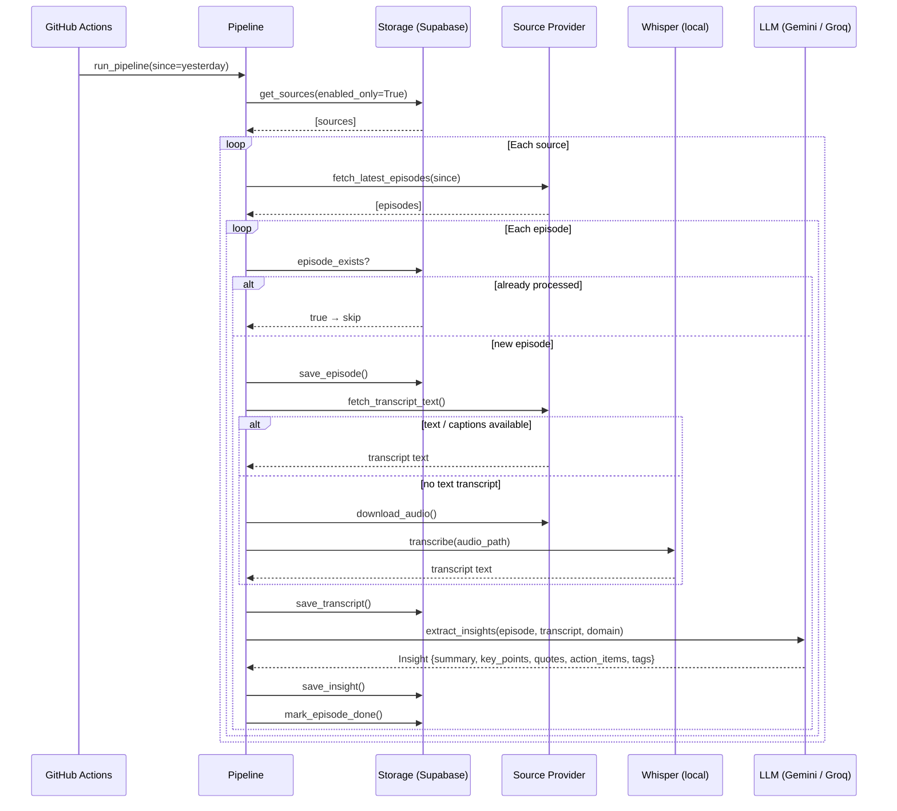
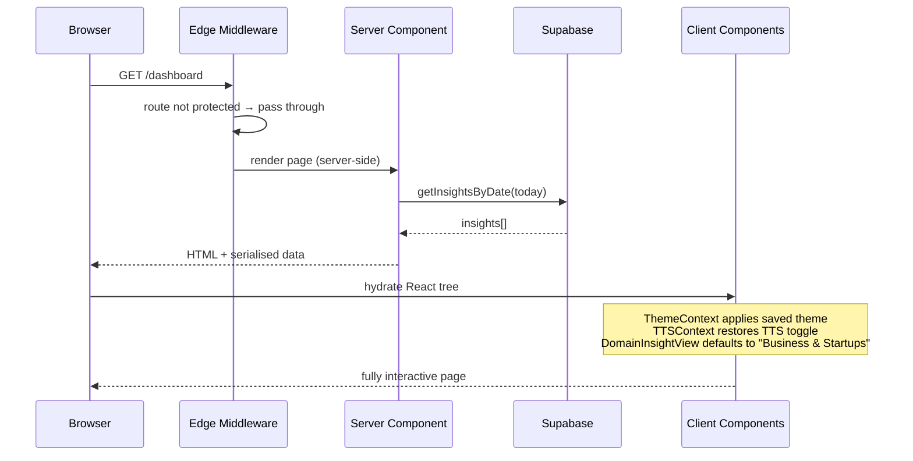
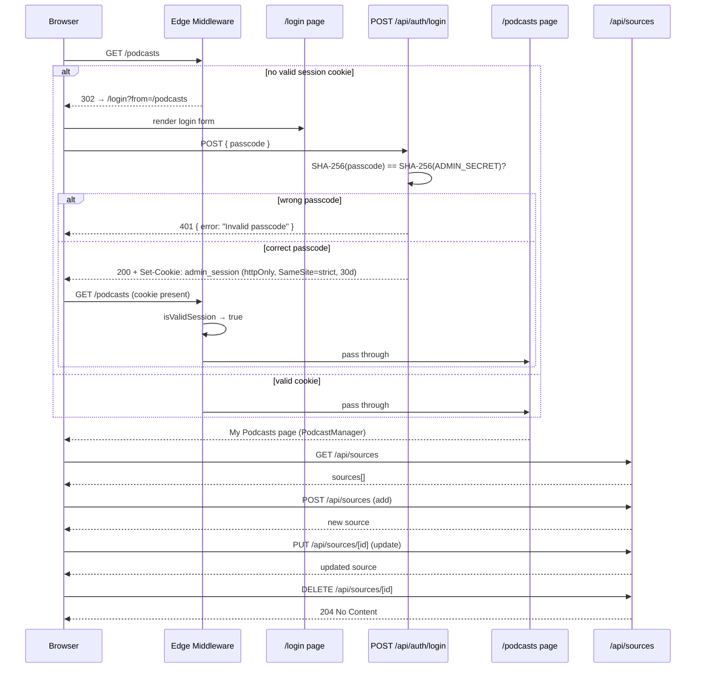
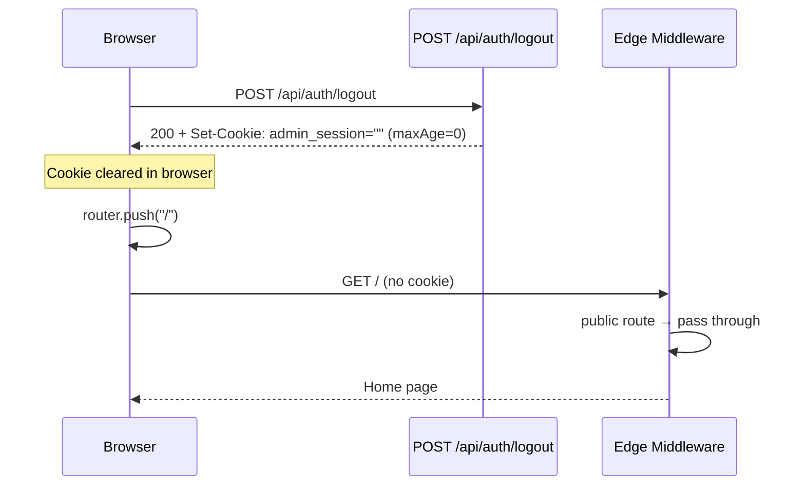

# Request Workflow Diagrams

## 1. Pipeline — GitHub Actions → Supabase

```mermaid
sequenceDiagram
    participant GHA as GitHub Actions
    participant P as Pipeline
    participant S as Storage (Supabase)
    participant SRC as Source Provider
    participant W as Whisper (local)
    participant LLM as LLM (Gemini / Groq)

    GHA->>P: run_pipeline(since=yesterday)
    P->>S: get_sources(enabled_only=True)
    S-->>P: [sources]

    loop Each source
        P->>SRC: fetch_latest_episodes(since)
        SRC-->>P: [episodes]

        loop Each episode
            P->>S: episode_exists?
            alt already processed
                S-->>P: true → skip
            else new episode
                P->>S: save_episode()
                P->>SRC: fetch_transcript_text()
                alt text / captions available
                    SRC-->>P: transcript text
                else no text transcript
                    P->>SRC: download_audio()
                    P->>W: transcribe(audio_path)
                    W-->>P: transcript text
                end
                P->>S: save_transcript()
                P->>LLM: extract_insights(episode, transcript, domain)
                LLM-->>P: Insight {summary, key_points, quotes, action_items, tags}
                P->>S: save_insight()
                P->>S: mark_episode_done()
            end
        end
    end
```

---

## 2. Public Dashboard Request — `/dashboard`

```mermaid
sequenceDiagram
    participant B as Browser
    participant MW as Edge Middleware
    participant SC as Server Component
    participant DB as Supabase
    participant CC as Client Components

    B->>MW: GET /dashboard
    MW->>MW: route not protected → pass through
    MW->>SC: render page (server-side)
    SC->>DB: getInsightsByDate(today)
    DB-->>SC: insights[]
    SC-->>B: HTML + serialised data

    B->>CC: hydrate React tree
    Note over CC: ThemeContext applies saved theme<br/>TTSContext restores TTS toggle<br/>DomainInsightView defaults to "Business & Startups"
    CC-->>B: fully interactive page
```

---

## 3. Auth-Gated Request — `/podcasts`

```mermaid
sequenceDiagram
    participant B as Browser
    participant MW as Edge Middleware
    participant LP as /login page
    participant LA as POST /api/auth/login
    participant PP as /podcasts page
    participant SA as /api/sources

    B->>MW: GET /podcasts

    alt no valid session cookie
        MW-->>B: 302 → /login?from=/podcasts
        B->>LP: render login form

        B->>LA: POST { passcode }
        LA->>LA: SHA-256(passcode) == SHA-256(ADMIN_SECRET)?

        alt wrong passcode
            LA-->>B: 401 { error: "Invalid passcode" }
        else correct passcode
            LA-->>B: 200 + Set-Cookie: admin_session (httpOnly, SameSite=strict, 30d)
            B->>MW: GET /podcasts  (cookie present)
            MW->>MW: isValidSession → true
            MW->>PP: pass through
        end
    else valid cookie
        MW->>PP: pass through
    end

    PP-->>B: My Podcasts page (PodcastManager)
    B->>SA: GET /api/sources
    SA-->>B: sources[]
    B->>SA: POST /api/sources  (add)
    SA-->>B: new source
    B->>SA: PUT /api/sources/[id]  (update)
    SA-->>B: updated source
    B->>SA: DELETE /api/sources/[id]
    SA-->>B: 204 No Content
```

---

## 4. Logout Flow

```mermaid
sequenceDiagram
    participant B as Browser
    participant LA as POST /api/auth/logout
    participant MW as Edge Middleware

    B->>LA: POST /api/auth/logout
    LA-->>B: 200 + Set-Cookie: admin_session="" (maxAge=0)
    Note over B: Cookie cleared in browser
    B->>B: router.push("/")
    B->>MW: GET /  (no cookie)
    MW->>MW: public route → pass through
    MW-->>B: Home page
```
