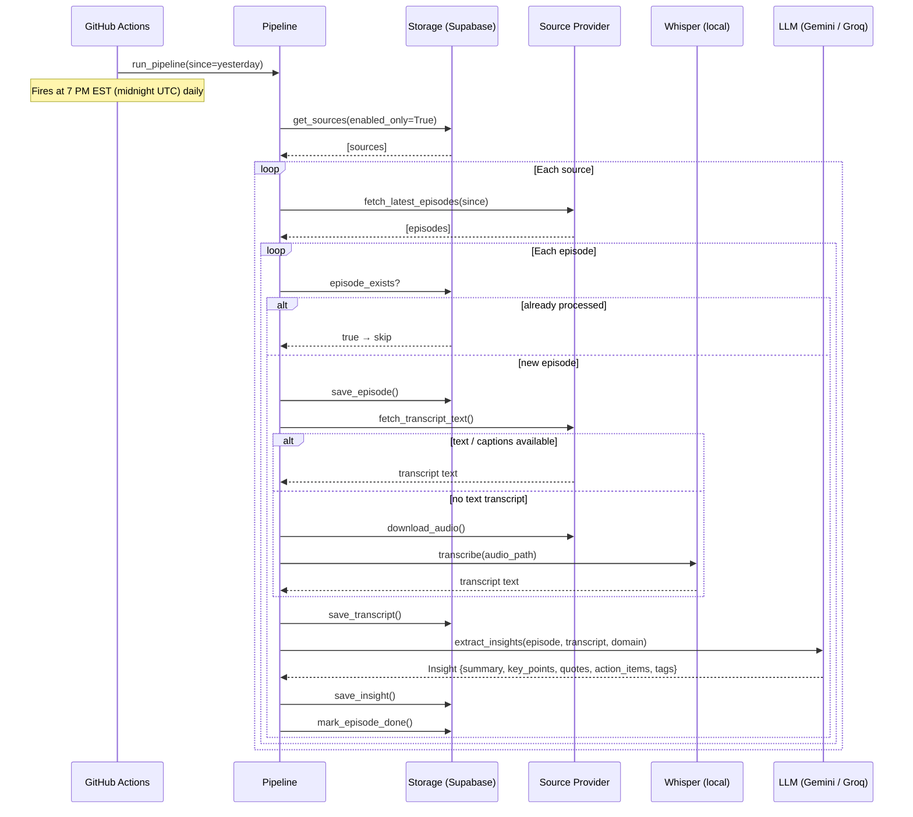
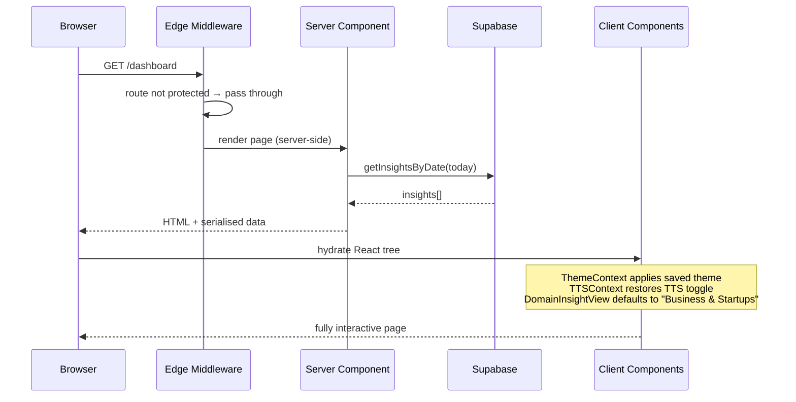
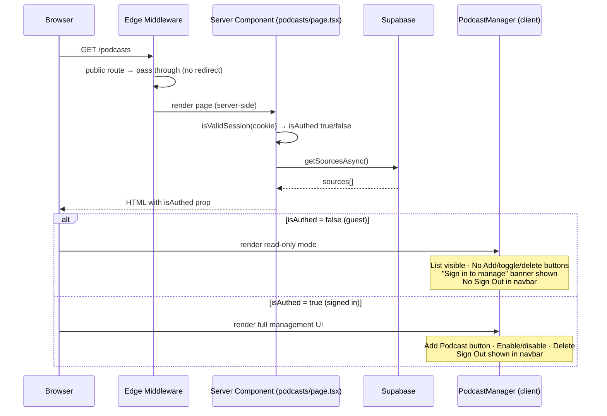
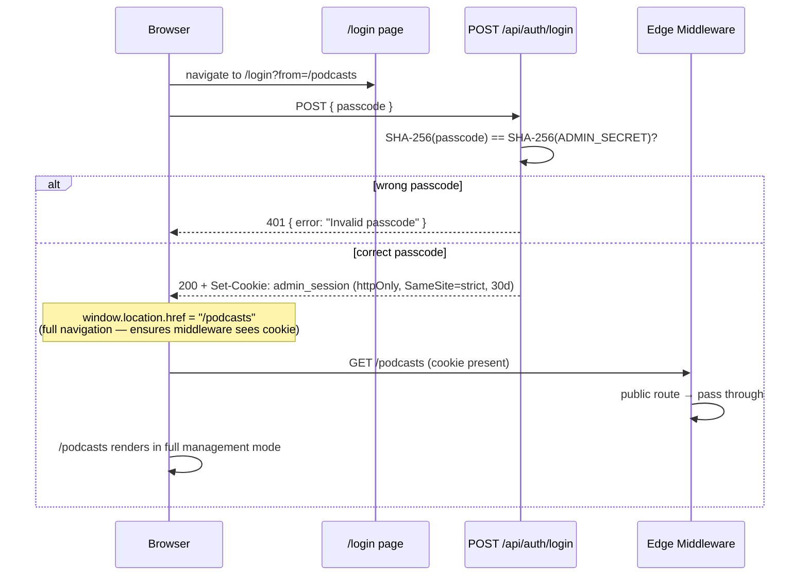
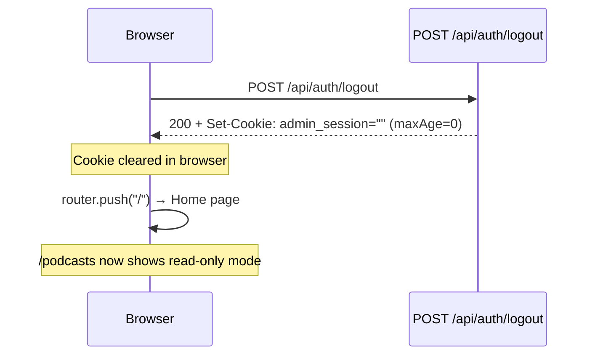
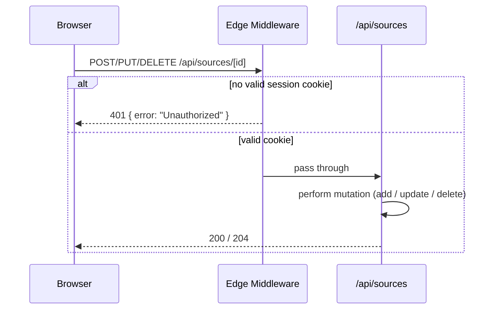

# Request Workflow Diagrams

## 1. Pipeline — GitHub Actions → Supabase

---

## 2. Public Dashboard Request — `/dashboard`

---

## 3. My Podcasts Page — Public with Auth-Aware UI

---

## 4. Login Flow

---

## 5. Logout Flow

---

## 6. API Source Mutation — Auth Guard

